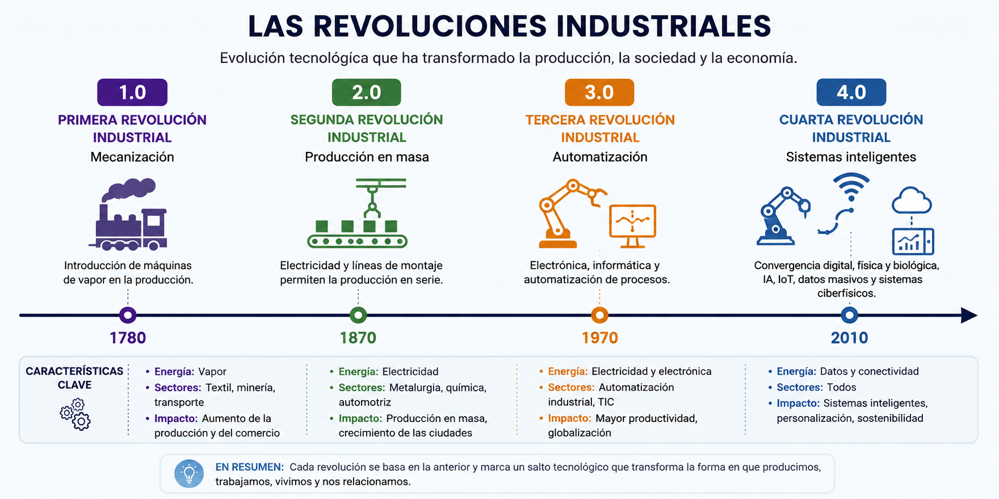
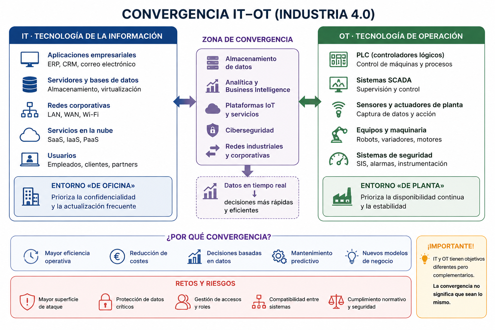
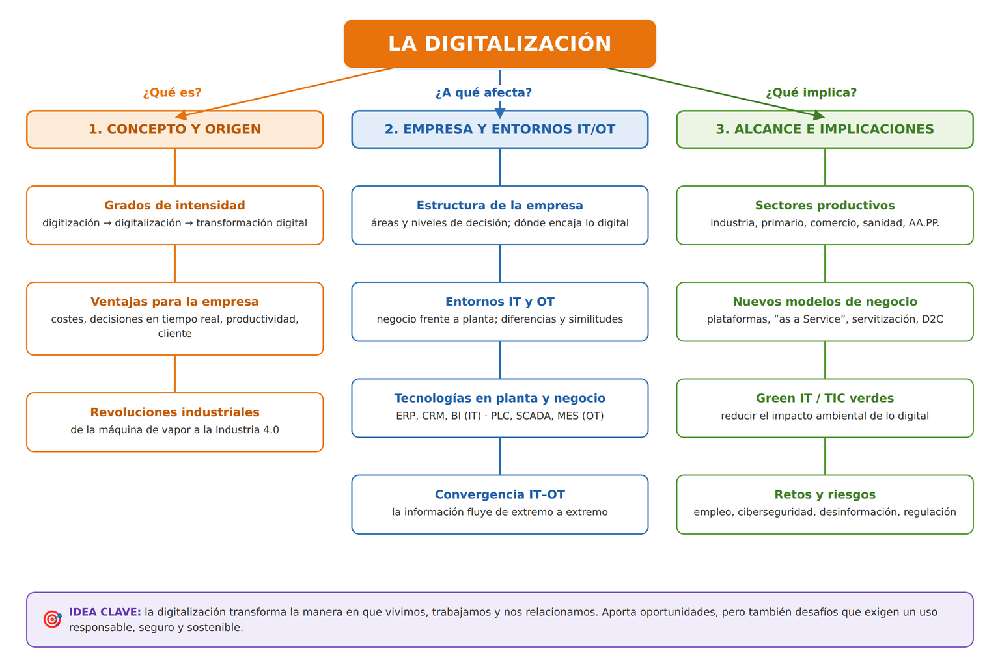

# UD1. Digitalización de los sectores productivos

!!! abstract "Resultado de aprendizaje"
    **RA1.** Analiza el concepto de digitalización y su repercusión en los sectores productivos teniendo en cuenta la actividad de la empresa e identificando entornos IT (*Information Technology*, tecnología de la información) y OT (*Operational Technology*, tecnología de operación) característicos.

## 1. De la sociedad industrial a la sociedad digital

La **digitalización** es el proceso de incorporar tecnologías digitales a las actividades de una organización, un sector o una sociedad, cambiando no solo las herramientas que se usan, sino también los procesos, los modelos de negocio y la forma de relacionarse con clientes, proveedores y trabajadores.

Conviene distinguir tres conceptos que a menudo se confunden:

| Concepto | Qué implica | Ejemplo |
|---|---|---|
| **Digitización** | Convertir información analógica en digital (cambia el soporte, no el proceso) | Escanear una factura en papel y guardarla como PDF |
| **Digitalización** | Usar tecnologías digitales para mejorar procesos existentes | Sustituir el registro en papel por un ERP |
| **Transformación digital** | Rediseñar el modelo de negocio y la cultura organizativa en torno a lo digital | Una tienda física que pasa a vender también por *marketplace*, con logística automatizada y atención por chatbot |

La transformación digital no es, por tanto, "comprar ordenadores": es un cambio estructural que afecta a procesos productivos, a la organización del trabajo, a la relación con el cliente y a la propia cultura de la empresa.

!!! question "💡 Comprueba que lo has entendido"
    ¿Dónde situarías cada caso?

    1. Escanear una factura en papel y guardarla como PDF.
    2. Implantar un ERP para sustituir el registro en papel.
    3. Crear una plataforma digital que cambia el modelo de negocio.

??? note "Ver respuesta"
    1. **Digitización** — cambia el soporte, no el proceso.
    2. **Digitalización** — se mejora con tecnología un proceso que ya existía.
    3. **Transformación digital** — se rediseña el modelo de negocio en torno a lo digital.

### 1.1. Las revoluciones industriales

La digitalización actual se entiende como la culminación de un proceso histórico de sucesivas revoluciones industriales:

<figure markdown="span">
  { width="900" }
  <figcaption>Cada revolución industrial añade una capa nueva sobre la anterior: de la fuerza mecánica a la electricidad, de la electrónica a la conexión de todos los procesos entre sí y con el mundo físico.</figcaption>
</figure>

La **cuarta revolución industrial o Industria 4.0** (desde ~2010) no se limita a automatizar: fusiona tecnologías digitales, físicas y biológicas — IoT, big data, inteligencia artificial, robótica avanzada, computación en la nube — para lograr sistemas de producción interconectados y capaces de tomar decisiones de forma autónoma o semiautónoma.

!!! tip "Para situarlo en el tiempo"
    Si la tercera revolución "informatizó" procesos ya existentes (por ejemplo, sustituir un libro de contabilidad en papel por una hoja de cálculo), la cuarta revolución **conecta** esos procesos entre sí y con el mundo físico, generando datos en tiempo real que alimentan decisiones automatizadas.

!!! question "💡 Comprueba que lo has entendido"
    Una fábrica sustituye sus libros de registro en papel por un sistema informático, pero cada máquina sigue funcionando de forma aislada. Más adelante conecta todas las máquinas y sus sensores para que compartan datos en tiempo real.

    **¿Con qué revolución industrial se corresponde cada paso?**

??? note "Ver respuesta"
    - Informatizar el registro sin conectar los procesos entre sí → **tercera revolución industrial**.
    - Conectar máquinas y sensores para intercambiar datos en tiempo real → **cuarta revolución industrial (Industria 4.0)**.

### 1.2. Entornos IT y OT

En cualquier organización industrial conviene distinguir dos entornos tecnológicos que tradicionalmente han evolucionado por separado:

- **IT (*Information Technology*, tecnología de la información)**: sistemas informáticos dedicados a gestionar la información del negocio — servidores, bases de datos, ERP, CRM, correo electrónico, redes corporativas. Es el entorno "de oficina": factura, planifica, analiza, comunica.
- **OT (*Operational Technology*, tecnología de operación)**: sistemas que controlan y supervisan procesos físicos y maquinaria — PLC (controladores lógicos programables), sistemas SCADA, sensores y actuadores de planta. Es el entorno "de planta": mueve, mide, actúa sobre el mundo físico.

|  | **IT – Information Technology** | **OT – Operational Technology** |
|---|---|---|
| **¿Qué gestiona?** | Información y sistemas de la empresa | Procesos físicos y máquinas |
| **Ejemplos** | Servidores, ERP, CRM, bases de datos | PLC, SCADA, sensores, actuadores |
| **Entorno** | Oficina / negocio | Planta / producción |
| **Objetivo principal** | Gestionar información | Controlar procesos físicos |
| **Prioridad** | Confidencialidad e integridad | Disponibilidad y estabilidad |
| **Ejemplo** | ERP registra un pedido | PLC controla una máquina |

Departamentos que suelen constituir entorno IT: administración, contabilidad, recursos humanos, sistemas/informática, marketing. Departamentos que suelen constituir entorno OT: producción, mantenimiento, control de calidad, logística de planta.

Tradicionalmente IT y OT han funcionado como mundos separados, con redes, protocolos y culturas de trabajo distintas: IT prioriza la confidencialidad y la actualización frecuente; OT prioriza la disponibilidad continua y la estabilidad, evitando cambios que puedan detener una línea de producción. La Industria 4.0 (véase 2.1) se caracteriza precisamente por la **convergencia IT-OT**: sensores de planta (OT) que envían datos a sistemas de análisis y toma de decisiones de negocio (IT), y decisiones de negocio que repercuten directamente en la configuración de la planta.

<figure markdown="span">
  { width="820" }
  <figcaption>El entorno IT gestiona la información del negocio y el entorno OT controla los procesos físicos; la Industria 4.0 los conecta en una zona de convergencia que aporta decisiones en tiempo real, pero también amplía la superficie de ataque.</figcaption>
</figure>

!!! tip "Por qué importa la conexión IT-OT"
    Digitalizar una empresa industrial "de extremo a extremo" significa que la información fluye sin fricción entre ambos entornos: un pedido registrado en el ERP (IT) puede ajustar automáticamente los parámetros de una máquina (OT), y un sensor de vibración en esa máquina (OT) puede generar una alerta de mantenimiento visible en el panel de gestión (IT). Esta conexión también multiplica la superficie de exposición a ciberataques, un aspecto que se retoma al hablar de las tecnologías habilitadoras (UD2) y de la nube (UD3).

!!! question "💡 Comprueba que lo has entendido"
    Un sensor detecta una temperatura anormal en una máquina y genera una alerta que aparece en el sistema de gestión de mantenimiento.

    **¿Qué parte pertenece a OT y cuál a IT?**

??? note "Ver respuesta"
    - **OT**: el sensor de temperatura instalado en la máquina y la medición de la variable física en planta. Es tecnología que actúa sobre el mundo físico y supervisa el proceso.
    - **IT**: el sistema de gestión de mantenimiento (GMAO) donde se registra, muestra y consulta la alerta. Es un sistema que gestiona información del negocio.
    - El **paso de la alerta** desde el sensor de planta hasta el sistema de gestión es justamente un ejemplo de **convergencia IT-OT**: un dato originado en OT alimenta una decisión que se toma y se gestiona en IT.

## 2. La digitalización por sectores productivos

Aunque el fenómeno es transversal, cada sector productivo lo incorpora de forma distinta según sus necesidades y su grado de madurez tecnológica.

### 2.1. Sector industrial: Industria 4.0

La industria fue pionera en la digitalización gracias a conceptos como:

- **Fábrica inteligente (*smart factory*)**: planta de producción donde máquinas, sensores y sistemas de información están interconectados.
- **Gemelo digital (*digital twin*)**: réplica virtual de un producto, proceso o sistema físico que permite simular su comportamiento antes de actuar sobre el elemento real.
- **Mantenimiento predictivo**: uso de sensores y análisis de datos para anticipar averías antes de que ocurran, en lugar de esperar a que fallen (mantenimiento correctivo) o revisar por calendario (mantenimiento preventivo).
- **Fabricación flexible**: líneas de producción reconfigurables que permiten personalizar productos sin perder eficiencia (personalización en masa).

!!! example "🏭 Ejemplo"
    - **Problema**: una máquina puede fallar sin previo aviso.
    - **Digitalización**: sensores + análisis de datos.
    - **Resultado**: mantenimiento predictivo.

### 2.2. Sector primario: agricultura y ganadería de precisión

- Sensores de humedad, temperatura y nutrientes del suelo.
- Drones para monitorización de cultivos y fumigación selectiva.
- Sistemas de riego automatizado basados en datos meteorológicos.
- Trazabilidad digital de alimentos, desde el origen hasta el consumidor.

!!! example "🏭 Ejemplo"
    - **Problema**: no todas las zonas del campo necesitan la misma cantidad de agua.
    - **Digitalización**: sensores de suelo + datos meteorológicos + riego automático.
    - **Resultado**: agricultura de precisión.

### 2.3. Comercio y logística

- **Comercio electrónico** y *marketplaces*.
- **Omnicanalidad**: integración de canales físicos y digitales de venta (comprar online y recoger en tienda, por ejemplo).
- Optimización de rutas de reparto mediante algoritmos.
- Almacenes automatizados y robots de picking.

!!! example "🏭 Ejemplo"
    - **Problema**: el cliente usa varios canales para informarse y comprar.
    - **Digitalización**: tienda física + web + app + logística integrada.
    - **Resultado**: omnicanalidad.

### 2.4. Sanidad

- Historia clínica electrónica y telemedicina.
- Dispositivos *wearables* de monitorización de constantes vitales.
- Diagnóstico asistido por inteligencia artificial (por ejemplo, análisis de imágenes médicas).

!!! example "🏭 Ejemplo"
    - **Problema**: un paciente crónico necesita seguimiento continuo sin acudir cada día al centro.
    - **Digitalización**: *wearables* + telemedicina + historia clínica electrónica.
    - **Resultado**: monitorización remota del paciente.

### 2.5. Educación

- Entornos virtuales de aprendizaje (Moodle, Google Classroom).
- Contenidos digitales interactivos y gamificación.
- Analítica del aprendizaje (*learning analytics*) para personalizar el proceso educativo.

!!! example "🏭 Ejemplo"
    - **Problema**: el alumnado avanza a ritmos distintos y un único material común deja a algunos atrás.
    - **Digitalización**: entorno virtual + contenidos interactivos + analítica del aprendizaje.
    - **Resultado**: aprendizaje personalizado.

### 2.6. Administración pública

- **Administración electrónica**: sede electrónica, registro electrónico, notificaciones telemáticas, cita previa online.
- Interoperabilidad entre administraciones (no pedir al ciudadano documentos que ya obran en poder de otra administración).
- Identificación digital: DNI electrónico, Cl@ve.

!!! example "🏭 Ejemplo"
    - **Problema**: un trámite obliga a desplazarse, hacer cola y aportar documentos que ya tiene la Administración.
    - **Digitalización**: sede electrónica + identidad digital (Cl@ve) + interoperabilidad entre administraciones.
    - **Resultado**: administración electrónica.

!!! reto "Reto: identifica la digitalización a tu alrededor"
    Piensa en tres organismos o negocios que utilices habitualmente (tu ayuntamiento, tu centro de salud, una tienda). Para cada uno, identifica un proceso que antes se hacía de forma presencial/en papel y que ahora se realiza total o parcialmente de forma digital. ¿Qué ha ganado el usuario? ¿Qué ha perdido?

## 3. Nuevos modelos de negocio digitales

La digitalización no solo mejora procesos existentes: también hace posibles modelos de negocio que antes no existían.

- **Economía de plataformas**: empresas que no producen el bien o servicio, sino que conectan oferta y demanda a través de una plataforma digital (aplicaciones de transporte con conductor, plataformas de alojamiento turístico, plataformas de reparto a domicilio).
- **Economía colaborativa**: intercambio de bienes o servicios entre particulares facilitado por una plataforma digital (coche compartido, alquiler de espacios entre particulares).
- **Modelos por suscripción (*as a Service*)**: el cliente paga una cuota periódica por el uso de un producto o servicio en lugar de comprarlo (software como servicio, música o vídeo en *streaming*, incluso "vehículo como servicio").
- **Servitización**: empresas industriales que añaden servicios digitales a su producto físico (un fabricante de maquinaria que ofrece también mantenimiento predictivo y monitorización remota).
- **Comercio electrónico directo al consumidor (D2C)**: el fabricante vende directamente al consumidor final, prescindiendo de intermediarios tradicionales.

!!! question "💡 Comprueba que lo has entendido"
    Un fabricante de compresores industriales deja de vender solo la máquina y pasa a ofrecer un contrato en el que cobra por el aire comprimido suministrado, con monitorización remota y mantenimiento incluido.

    **¿Qué modelo de negocio digital está adoptando?**

??? note "Ver respuesta"
    **Servitización**: la empresa industrial añade servicios digitales a su producto físico. Además, encaja con un modelo *as a Service*, porque el cliente paga por el uso (aire comprimido) en lugar de comprar el equipo.

## 4. La competencia digital: el marco DigComp

Para que las personas puedan participar en esta economía digital necesitan desarrollar una **competencia digital** adecuada. La Unión Europea ha definido el **Marco Europeo de Competencia Digital para la Ciudadanía (DigComp)**, que estructura la competencia digital en cinco áreas:

1. **Información y alfabetización informacional**: buscar, evaluar y gestionar información digital.
2. **Comunicación y colaboración**: interactuar, compartir y colaborar a través de tecnologías digitales; participar en la ciudadanía digital.
3. **Creación de contenido digital**: desarrollar y editar contenido digital, respetando derechos de autor y licencias.
4. **Seguridad**: proteger dispositivos, datos personales, salud y medio ambiente en el entorno digital.
5. **Resolución de problemas**: identificar necesidades tecnológicas y resolver problemas conceptuales mediante medios digitales; identificar carencias en la propia competencia digital.

DigComp establece **ocho niveles de competencia**, desde los niveles básicos hasta los altamente especializados, que permiten describir la progresión en las cinco áreas. Este marco es la base sobre la que se apoyan los planes de digitalización educativa y muchos de los contenidos que se trabajan a lo largo de este módulo.

!!! tip "Autoevaluación DigComp"
    Existen herramientas gratuitas basadas en DigComp que permiten autoevaluar el propio nivel de competencia digital (por ejemplo, la herramienta *DigCompSat* de la Comisión Europea). En la UD6 retomaremos este marco para elaborar un plan personal de mejora.

## 5. La brecha digital

La **brecha digital** es la desigualdad en el acceso, uso o aprovechamiento de las tecnologías digitales entre distintos grupos de población. Suele distinguirse en tres niveles:

- **Brecha de primer nivel (acceso)**: diferencias en la disponibilidad de dispositivos y conexión a internet (por ejemplo, entre zonas rurales y urbanas, o según el nivel de renta).
- **Brecha de segundo nivel (uso y competencias)**: diferencias en la capacidad para usar la tecnología de forma efectiva, aunque se tenga acceso a ella.
- **Brecha de tercer nivel (resultados)**: diferencias en los beneficios reales que las personas obtienen del uso de la tecnología (por ejemplo, en oportunidades laborales o educativas).

Colectivos especialmente afectados: personas mayores, personas con discapacidad, población en zonas rurales o con baja cobertura, personas con bajo nivel de estudios o rentas bajas.

Algunas medidas para reducirla: extensión de la banda ancha y la cobertura móvil a zonas rurales (planes de conectividad), formación digital para colectivos vulnerables, diseño de servicios digitales accesibles (accesibilidad web, diseño universal) y mantenimiento de canales presenciales alternativos para trámites esenciales.

!!! question "💡 Comprueba que lo has entendido"
    Dos personas tienen móvil y conexión a internet. Una consigue cita médica, hace gestiones bancarias y busca empleo online; la otra solo usa mensajería y vídeos porque no sabe realizar esas gestiones.

    **¿Qué nivel de brecha digital ilustra esta situación?**

??? note "Ver respuesta"
    La **brecha de segundo nivel (uso y competencias)**: ambas tienen acceso, pero difieren en la capacidad de usar la tecnología de forma efectiva. Si esa diferencia acaba traduciéndose en peores oportunidades laborales o educativas, aparece también la **brecha de tercer nivel (resultados)**.

## 6. Digitalización sostenible (*Green IT*)

La digitalización tiene un impacto ambiental que no siempre es visible:

- **Consumo energético de los centros de datos**: almacenar y procesar datos en la nube requiere electricidad, refrigeración y, en muchos casos, agua.
- **Huella de carbono de los dispositivos**: fabricación (extracción de materias primas, minerales críticos), transporte, uso y fin de vida (residuos electrónicos o *e-waste*).
- **Obsolescencia programada y percibida**: dispositivos diseñados para durar poco o percibidos como obsoletos aunque sigan siendo funcionales, lo que acelera el reemplazo y el volumen de residuos.

Frente a esto, el concepto de **TIC verdes (*Green IT*)** agrupa las prácticas orientadas a reducir este impacto:

- Eficiencia energética en centros de datos (refrigeración eficiente, ubicación en climas fríos, energías renovables).
- Alargar la vida útil de los equipos (reparabilidad, actualización de componentes en lugar de sustitución completa).
- Reciclaje y economía circular de dispositivos electrónicos (recogida selectiva de RAEE — Residuos de Aparatos Eléctricos y Electrónicos).
- Software eficiente: aplicaciones que consumen menos recursos y, por tanto, menos energía.

!!! reto "Reto: calcula tu huella digital"
    Existen calculadoras online de huella de carbono digital que estiman el impacto de tus dispositivos y de tu consumo de datos (vídeo en streaming, redes sociales, correo electrónico). Usa una de ellas y anota tres hábitos digitales concretos que podrías cambiar para reducir tu impacto.

!!! question "💡 Comprueba que lo has entendido"
    Una empresa renueva todos los portátiles cada dos años aunque funcionen bien y conserva de forma indefinida copias de vídeos que nadie consulta en un centro de datos.

    **Indica dos malas prácticas desde el punto de vista del *Green IT* y una alternativa para cada una.**

??? note "Ver respuesta"
    - Sustituir equipos funcionales cada poco tiempo → **alargar su vida útil** (reparación, ampliación de componentes en lugar de reemplazo completo).
    - Almacenar datos innecesarios de forma indefinida → **borrar lo que no se usa**; el almacenamiento en la nube consume electricidad, refrigeración y agua.

## 7. Retos y riesgos de la digitalización

No todo son ventajas. Entre los principales retos y riesgos asociados a la digitalización de los sectores productivos destacan:

- **Impacto en el empleo**: automatización de tareas rutinarias, necesidad de recualificación profesional (*reskilling*) y actualización continua de competencias (*upskilling*).
- **Dependencia tecnológica**: vulnerabilidad ante fallos técnicos, ciberataques o interrupciones del suministro eléctrico o de conectividad.
- **Ciberseguridad**: la digitalización multiplica la superficie de exposición a amenazas (se estudia en profundidad en la UD3, al hablar de la nube, y de forma transversal en todo el módulo).
- **Desinformación**: la facilidad para generar y difundir contenido digital (incluido contenido generado por IA) facilita también la propagación de información falsa o manipulada.
- **Concentración de poder digital**: dependencia de un número reducido de grandes proveedores tecnológicos, lo que plantea cuestiones de soberanía digital (se retoma en la UD3).
- **Marco regulatorio**: necesidad de adaptar leyes y normas (protección de datos, propiedad intelectual, regulación de la inteligencia artificial) al ritmo del cambio tecnológico.

!!! question "💡 Comprueba que lo has entendido"
    Un taller automatiza el diagnóstico de averías con un sistema informático conectado a internet. Un día, un fallo de conexión deja el taller parado varias horas y, además, se detecta que ese sistema es un posible objetivo de ciberataque.

    **¿Qué dos riesgos de la digitalización se están manifestando?**

??? note "Ver respuesta"
    - **Dependencia tecnológica**: la actividad se detiene ante un fallo de conectividad.
    - **Ciberseguridad**: conectar el sistema a internet amplía la superficie de exposición a amenazas.

---

## Actividades

**Actividad 1.1 — Mapa de digitalización de un sector**

Elige un sector productivo (por ejemplo, hostelería, transporte, construcción o el propio sector TIC) y elabora un breve informe (una página) que identifique:

1. Tres tecnologías digitales que ya se usan habitualmente en ese sector.
2. Un ejemplo real de empresa del sector que haya llevado a cabo una transformación digital relevante.
3. Un riesgo o reto específico de la digitalización en ese sector.

**Actividad 1.2 — Autoevaluación DigComp**

Realiza una autoevaluación de tu competencia digital utilizando el marco DigComp (puedes usar una herramienta online basada en este marco). Identifica el área en la que obtienes menor puntuación y propón dos acciones concretas para mejorarla.

**Actividad 1.3 — Debate: ¿digitalización para todos?**

En grupos, preparad argumentos a favor y en contra de la siguiente afirmación: *"La digitalización acelerada de los servicios públicos deja atrás a quienes no tienen competencias digitales"*. Debatid en clase citando ejemplos reales.

## Autoevaluación

??? question "1. ¿Qué diferencia hay entre digitalización y transformación digital?"
    La digitalización consiste en aplicar tecnologías digitales a procesos ya existentes para mejorarlos (por ejemplo, sustituir el papel por un documento digital). La transformación digital va más allá: implica repensar el modelo de negocio, la organización y la cultura de la empresa en torno a lo digital.

??? question "2. ¿Qué diferencia hay entre un entorno IT y un entorno OT en una empresa industrial?"
    El entorno IT (*Information Technology*) gestiona la información del negocio: servidores, bases de datos, ERP, redes corporativas. El entorno OT (*Operational Technology*) controla y supervisa procesos físicos y maquinaria: PLC, sistemas SCADA, sensores y actuadores de planta. La Industria 4.0 se caracteriza por la convergencia de ambos entornos.

??? question "3. Cita las cinco áreas del marco DigComp."
    Información y alfabetización informacional; comunicación y colaboración; creación de contenido digital; seguridad; resolución de problemas.

??? question "4. ¿Qué es un gemelo digital y para qué se utiliza en la Industria 4.0?"
    Es una réplica virtual de un producto, proceso o sistema físico que permite simular su comportamiento sin necesidad de actuar sobre el elemento real, anticipando problemas y optimizando decisiones antes de aplicarlas en el mundo físico.

??? question "5. Menciona dos medidas para reducir la brecha digital."
    Por ejemplo: extender la cobertura de banda ancha a zonas rurales y ofrecer formación digital a colectivos vulnerables (también seria válido: mantener canales presenciales alternativos, o diseñar servicios digitales accesibles).

??? question "6. ¿Qué significa el término *Green IT*?"
    El conjunto de prácticas orientadas a reducir el impacto ambiental de las tecnologías digitales: eficiencia energética de los centros de datos, alargamiento de la vida útil de los dispositivos, reciclaje de residuos electrónicos y desarrollo de software eficiente.

## Mapa conceptual

<figure markdown="span">
  { width="960" }
  <figcaption>Síntesis de la unidad: la digitalización se aborda desde su <strong>concepto y origen</strong> (grados de intensidad y revoluciones industriales), su <strong>alcance y aplicación</strong> (convergencia IT–OT, sectores productivos y nuevos modelos de negocio) y sus <strong>implicaciones</strong> sociales y ambientales (competencia digital, brecha digital, Green IT y retos y riesgos).</figcaption>
</figure>
