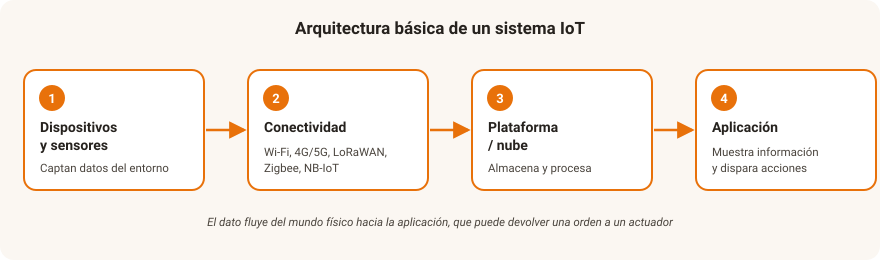

# UD2. Tecnologías digitales habilitadoras

!!! abstract "Resultado de aprendizaje"
    **RA2.** Caracteriza las tecnologías habilitadoras digitales necesarias para la adecuación/transformación de las empresas a entornos digitales describiendo sus características y aplicaciones.

## 1. Qué es una tecnología habilitadora

Se llaman **tecnologías digitales habilitadoras** (en inglés, *enabling technologies*) a aquellas tecnologías que, por sí mismas, no resuelven un problema concreto de un sector, pero **hacen posible** que se desarrollen soluciones digitales avanzadas en múltiples sectores a la vez. Son la base técnica sobre la que se construye la Industria 4.0 y, en general, la digitalización de los sectores productivos vista en la UD1.

En esta unidad estudiamos las principales: el Internet de las Cosas, el Big Data, la robótica y automatización de procesos, blockchain, la realidad extendida, la impresión 3D, la conectividad avanzada (5G) y la ciberseguridad como tecnología transversal. La computación en la nube y la inteligencia artificial, por su peso específico, se estudian con más detalle en las UD3 y UD4.

!!! tip "Cómo se relacionan entre sí"
    Estas tecnologías raramente se usan aisladas: un sistema de mantenimiento predictivo típico combina **sensores IoT** (que generan datos), **big data** (que los almacena y procesa), **inteligencia artificial** (que detecta patrones de fallo) y **la nube** (donde se ejecuta todo el proceso).

## 2. Internet de las Cosas (IoT)

El **Internet de las Cosas (*Internet of Things*, IoT)** es la red de objetos físicos (sensores, electrodomésticos, vehículos, maquinaria industrial) equipados con capacidad de conexión que les permite recopilar y transmitir datos, y en muchos casos recibir órdenes, a través de internet.

### 2.1. Arquitectura básica de un sistema IoT

1. **Dispositivos y sensores**: capturan datos del entorno (temperatura, humedad, movimiento, localización, consumo eléctrico...).
2. **Conectividad**: los datos se transmiten mediante distintas tecnologías según el caso de uso — Wi-Fi, Bluetooth, redes móviles (4G/5G), o protocolos de bajo consumo como LoRaWAN, Zigbee o NB-IoT (pensados para dispositivos que envían pocos datos y deben durar años con batería).
3. **Plataforma / nube**: recibe, almacena y procesa los datos, a menudo en la nube (véase UD3).
4. **Aplicación**: capa que presenta la información al usuario o dispara acciones automáticas (una alarma, el encendido de un actuador, una notificación).

<figure markdown="span">
  { width="800" }
  <figcaption>El dato viaja desde los sensores hasta la aplicación, que puede devolver una orden a un actuador del entorno físico.</figcaption>
</figure>

### 2.2. Aplicaciones del IoT

| Ámbito | Ejemplos |
|---|---|
| Hogar (*smart home*) | Termostatos inteligentes, cerraduras conectadas, asistentes de voz |
| Ciudad (*smart city*) | Sensores de tráfico, contenedores de basura que avisan cuando están llenos, farolas que regulan su intensidad |
| Industria (IIoT) | Sensores de vibración y temperatura en maquinaria para mantenimiento predictivo |
| Agricultura de precisión | Sensores de humedad del suelo, estaciones meteorológicas (véase UD1) |
| Salud (*wearables*) | Pulseras y relojes que monitorizan constantes vitales |
| Logística | Trazabilidad de mercancías, sensores de temperatura en transporte de productos refrigerados |

!!! reto "Reto: identifica un sistema IoT"
    Piensa en un dispositivo IoT que uses o conozcas (una pulsera de actividad, un termostato inteligente, un contador de electricidad "inteligente"). Describe qué dato capta, cómo lo transmite y qué decisión o acción se toma con ese dato.

!!! question "💡 Comprueba que lo has entendido"
    Un invernadero coloca sondas de humedad en el suelo; cuando la humedad baja de un umbral, se abre automáticamente una electroválvula de riego y el agricultor recibe un aviso en el móvil.

    **Asocia cada elemento con su capa de la arquitectura IoT: dispositivos/sensores, conectividad, plataforma/nube y aplicación.**

??? note "Ver respuesta"
    - **Dispositivos/sensores**: las sondas de humedad del suelo (y la electroválvula, como actuador).
    - **Conectividad**: la red que transmite las lecturas (por ejemplo, LoRaWAN o Wi-Fi).
    - **Plataforma/nube**: el servicio que recibe los datos, guarda el histórico y los compara con el umbral.
    - **Aplicación**: la lógica que ordena abrir la válvula y envía el aviso al móvil del agricultor.

## 3. Big Data

El **Big Data** hace referencia a conjuntos de datos tan grandes, rápidos o variados que las herramientas tradicionales de gestión de bases de datos no son capaces de procesarlos eficientemente. Suele caracterizarse mediante las llamadas **"V" del Big Data**:

- **Volumen**: cantidad de datos generados (terabytes, petabytes...).
- **Velocidad**: rapidez con la que se generan y deben procesarse los datos (a veces en tiempo real).
- **Variedad**: diversidad de formatos — datos estructurados (tablas), semiestructurados (JSON, XML) y no estructurados (texto libre, imágenes, vídeo, audio).
- **Veracidad**: fiabilidad y calidad de los datos (datos incompletos, duplicados o erróneos afectan a las conclusiones).
- **Valor**: la utilidad real que se extrae de los datos; el objetivo final de todo el proceso.

### 3.1. Ciclo de vida del dato en Big Data

1. **Captación**: sensores IoT, transacciones, formularios web, redes sociales, registros de sistemas (*logs*).
2. **Almacenamiento**: bases de datos distribuidas, *data lakes* (almacenes de datos en bruto) y *data warehouses* (almacenes de datos estructurados y depurados para análisis).
3. **Procesamiento y análisis**: técnicas estadísticas, minería de datos y modelos de aprendizaje automático (véase UD4) para encontrar patrones.
4. **Visualización y toma de decisiones**: paneles de control (*dashboards*) e informes que traducen los resultados en decisiones de negocio (se profundiza en la UD5).

!!! tip "Relación con la UD5"
    El Big Data se centra en la infraestructura y las técnicas para *manejar* grandes volúmenes de datos; la evaluación de la calidad de esos datos, su análisis y su uso responsable se trabajan en profundidad en la UD5.

!!! question "💡 Comprueba que lo has entendido"
    Una cadena de tiendas analiza cada noche millones de tickets de compra (tablas), reseñas de clientes en texto libre y vídeo de las cámaras de sala; además, necesita que los datos de stock se procesen al instante.

    **¿Qué "V" del Big Data se reconocen en este caso?**

??? note "Ver respuesta"
    - **Volumen**: millones de tickets cada día.
    - **Variedad**: datos estructurados (tablas) y no estructurados (texto de reseñas, vídeo).
    - **Velocidad**: parte del procesamiento debe hacerse en tiempo real (stock).
    - Todavía habría que valorar la **veracidad** (calidad de los datos) para poder extraer **valor**.

## 4. Robótica y automatización de procesos

- **Robótica industrial clásica**: robots programados para tareas repetitivas en entornos controlados (brazos robóticos en cadenas de montaje).
- **Robótica colaborativa (*cobots*)**: robots diseñados para trabajar codo con codo con personas, con sensores de seguridad que detienen su movimiento ante un contacto imprevisto.
- **Automatización robótica de procesos (RPA — *Robotic Process Automation*)**: software que imita las acciones de una persona sobre aplicaciones informáticas (rellenar formularios, copiar datos entre sistemas, generar informes) para automatizar tareas administrativas repetitivas, sin necesidad de robots físicos.

!!! question "💡 Comprueba que lo has entendido"
    Una gestoría quiere automatizar el traspaso de datos entre su programa de facturación y el de contabilidad, una tarea que hoy hace una persona copiando campos a mano.

    **¿Qué opción encaja mejor: robótica industrial, cobots o RPA? ¿Por qué?**

??? note "Ver respuesta"
    **RPA**: es una tarea administrativa, repetitiva y realizada sobre aplicaciones informáticas, sin ningún componente físico. No se necesitan robots (ni industriales ni colaborativos), sino software que reproduzca las acciones de la persona sobre esos programas.

## 5. Blockchain y tecnologías de registro distribuido

**Blockchain** (cadena de bloques) es una tecnología de registro distribuido: una base de datos compartida entre múltiples participantes (nodos), en la que la información se organiza en bloques enlazados criptográficamente, de forma que una vez registrado un dato resulta extremadamente difícil modificarlo sin que se detecte.

Características principales:

- **Descentralización**: no depende de una autoridad central única; la copia del registro se distribuye entre muchos nodos.
- **Inmutabilidad**: modificar un bloque exigiría modificar también todos los bloques posteriores en todos los nodos de la red, lo que la hace prácticamente inviable.
- **Transparencia y trazabilidad**: todas las operaciones quedan registradas y son verificables.

Aplicaciones más allá de las criptomonedas: trazabilidad de la cadena de suministro (por ejemplo, seguir el origen de un alimento desde el productor hasta el punto de venta), contratos inteligentes (*smart contracts*, programas que ejecutan automáticamente cláusulas contractuales cuando se cumplen ciertas condiciones), certificación de documentos y títulos académicos.

!!! question "💡 Comprueba que lo has entendido"
    Una cooperativa quiere que cualquier consumidor pueda comprobar el recorrido de una botella de aceite desde el olivar hasta la tienda, sin depender de que la propia cooperativa "dé fe" de esos datos.

    **¿Qué propiedades de blockchain responden a esta necesidad?**

??? note "Ver respuesta"
    - **Descentralización**: el registro no depende de una única autoridad; lo mantienen varios nodos.
    - **Inmutabilidad**: una vez anotado un paso de la cadena, no se puede alterar sin que se detecte.
    - **Transparencia y trazabilidad**: cada operación queda registrada y es verificable por cualquiera.

    Un *smart contract* podría, además, liberar el pago al productor en cuanto se confirma la entrega.

## 6. Realidad virtual, aumentada y mixta

| Tecnología | Qué hace | Ejemplo de uso |
|---|---|---|
| **Realidad virtual (RV)** | Sumerge al usuario en un entorno totalmente digital, generalmente con gafas o cascos | Simuladores de formación (pilotaje, cirugía, manejo de maquinaria peligrosa) |
| **Realidad aumentada (RA)** | Superpone información digital sobre el entorno real, visible a través de una pantalla, gafas o cámara | Manual de reparación que muestra indicaciones superpuestas sobre la propia máquina |
| **Realidad mixta** | Combina elementos reales y virtuales que pueden interactuar entre sí | Diseño colaborativo de un producto donde varias personas manipulan un modelo 3D compartido |

Aplicaciones profesionales destacadas: formación de personal en entornos de riesgo sin peligro real, mantenimiento asistido (un técnico ve superpuestas las instrucciones sobre la propia máquina), diseño y prototipado virtual, y visitas o *showrooms* virtuales en comercio y turismo.

!!! question "💡 Comprueba que lo has entendido"
    Clasifica cada situación como RV, RA o realidad mixta:

    1. Un operario ve, a través de unas gafas, las instrucciones de reparación superpuestas sobre la máquina real.
    2. Un alumno de enfermería practica una intervención con un casco que le muestra un quirófano totalmente digital.
    3. Dos ingenieros en salas distintas manipulan a la vez el mismo modelo 3D, anclado sobre una mesa real.

??? note "Ver respuesta"
    1. **Realidad aumentada** — se añade información digital sobre el entorno real.
    2. **Realidad virtual** — el entorno es totalmente digital.
    3. **Realidad mixta** — objetos reales y virtuales conviven e interactúan entre sí.

## 7. Impresión 3D y fabricación aditiva

La **fabricación aditiva**, popularmente conocida como impresión 3D, construye objetos añadiendo material capa a capa (a partir de un diseño digital), frente a la fabricación tradicional o sustractiva (que parte de un bloque de material y elimina lo sobrante, como en el mecanizado).

Ventajas: permite prototipado rápido, personalización de piezas sin coste adicional de reconfiguración, fabricación bajo demanda (reduciendo la necesidad de almacenar stock) y producción descentralizada (fabricar la pieza cerca de donde se necesita, en lugar de transportarla).

Limitaciones: velocidad de producción más lenta que la fabricación en serie tradicional para grandes volúmenes, y limitaciones en los materiales disponibles según la tecnología de impresión.

!!! question "💡 Comprueba que lo has entendido"
    Un fabricante de maquinaria agrícola necesita una pieza de repuesto descatalogada para un tractor antiguo: solo necesita una unidad y la necesita pronto.

    **¿Por qué la fabricación aditiva encaja bien aquí y no lo haría para producir 50.000 unidades de esa misma pieza?**

??? note "Ver respuesta"
    Para **una pieza única y urgente** aprovecha sus ventajas: fabricación bajo demanda, sin utillaje ni reconfiguración, y producción cerca de donde se necesita. Para **50.000 unidades** pesan sus limitaciones: es más lenta que la fabricación en serie y el coste por pieza no compensa frente al moldeado o el mecanizado a gran escala.

## 8. Conectividad avanzada: 5G y redes de nueva generación

Las tecnologías anteriores (IoT masivo, realidad aumentada, vehículos autónomos, telecirugía) necesitan redes de comunicación con prestaciones que las generaciones anteriores de telefonía móvil no podían ofrecer. El **5G** aporta tres mejoras clave:

- **Mayor velocidad de transmisión** (banda ancha móvil mejorada).
- **Menor latencia** (tiempo de respuesta), crítica en aplicaciones que requieren reacción casi instantánea, como el control remoto de maquinaria o vehículos.
- **Mayor densidad de conexiones simultáneas**, necesaria para escenarios con miles de sensores IoT en un espacio reducido (una fábrica, un puerto).

!!! question "💡 Comprueba que lo has entendido"
    Relaciona cada necesidad con la mejora del 5G que la hace posible:

    1. Un puerto con decenas de miles de sensores en pocas hectáreas.
    2. El control remoto en tiempo real de una grúa desde una sala de operaciones.
    3. Descargar planos en alta resolución al móvil desde cualquier punto de la obra.

??? note "Ver respuesta"
    1. **Mayor densidad de conexiones simultáneas.**
    2. **Menor latencia** (tiempo de respuesta casi instantáneo).
    3. **Mayor velocidad de transmisión** (banda ancha móvil mejorada).

## 9. La ciberseguridad como tecnología habilitadora transversal

Cuantos más dispositivos, sensores y sistemas se conectan, mayor es la **superficie de exposición** a ciberataques. Por eso la ciberseguridad no es una tecnología habilitadora "más", sino una condición necesaria para que todas las demás puedan desplegarse con confianza: sin garantías de seguridad, ninguna empresa conectará su maquinaria industrial a internet, ni ningún ciudadano confiará sus datos a un sistema digital. Este módulo dedica contenido específico a la seguridad en la nube (UD3) y a la protección de datos (UD5); aquí basta con retener que **la seguridad debe diseñarse desde el principio (*security by design*)**, no añadirse al final del proceso.

!!! question "💡 Comprueba que lo has entendido"
    Una empresa termina de desarrollar su plataforma IoT para conectar la maquinaria y, solo entonces, encarga una auditoría para "añadirle seguridad" antes de salir a producción.

    **¿Qué principio no se ha respetado y qué implica?**

??? note "Ver respuesta"
    No se ha aplicado la **seguridad desde el diseño (*security by design*)**: la protección debe formar parte de las decisiones desde el inicio del proyecto, no añadirse al final. Corregir fallos de arquitectura al terminar suele ser más caro, más lento y menos eficaz que haberlos evitado desde el principio.

---

## Actividades

**Actividad 2.1 — Diseña un sistema IoT**

Elige un problema cotidiano (por ejemplo, controlar el riego de las plantas de tu casa, o saber si queda sitio libre en un parking). Diseña sobre el papel un sistema IoT que lo resuelva, indicando: qué sensor(es) usarías, cómo transmitirías los datos, dónde se almacenarían y qué acción se dispararía automáticamente.

**Actividad 2.2 — Investigación: tecnologías habilitadoras en una empresa real**

Busca una noticia reciente sobre una empresa (española o internacional) que haya implantado alguna de las tecnologías estudiadas en esta unidad (IoT, big data, RPA, blockchain, realidad aumentada, impresión 3D o 5G). Resume en cinco líneas qué problema resolvía y qué resultado obtuvo.

**Actividad 2.3 — Cuadro comparativo**

Elabora una tabla que relacione cada una de las tecnologías habilitadoras estudiadas con al menos un sector productivo de la UD1 en el que tenga especial relevancia.

## Autoevaluación

??? question "1. ¿Qué son las 'V' del Big Data? Cita al menos tres."
    Volumen, velocidad, variedad, veracidad y valor. (Se consideran correctas cualesquiera tres de las cinco.)

??? question "2. Diferencia entre un robot industrial clásico y un cobot."
    El robot industrial clásico trabaja en un entorno controlado y aislado de las personas, realizando tareas repetitivas programadas. El cobot (robot colaborativo) está diseñado para trabajar junto a personas, con sensores de seguridad que detienen su movimiento ante un contacto imprevisto.

??? question "3. ¿Qué característica de blockchain hace que sea difícil modificar un dato ya registrado?"
    Que los bloques están enlazados criptográficamente y la información se distribuye entre múltiples nodos: modificar un bloque exigiría modificar también todos los posteriores en todas las copias de la red, lo que resulta prácticamente inviable.

??? question "4. ¿Qué diferencia hay entre realidad virtual y realidad aumentada?"
    La realidad virtual sumerge al usuario en un entorno totalmente digital; la realidad aumentada superpone información digital sobre el entorno real, sin sustituirlo.

??? question "5. ¿Por qué el 5G es especialmente relevante para el Internet de las Cosas?"
    Porque ofrece mayor velocidad, menor latencia y capacidad para soportar un número muy elevado de dispositivos conectados simultáneamente, condiciones necesarias para escenarios de IoT masivo o aplicaciones que exigen respuesta casi instantánea.

??? question "6. Cita las cuatro capas de un sistema IoT."
    Dispositivos y sensores; conectividad; plataforma o nube; y aplicación. El dato viaja desde los sensores hasta la aplicación, que puede devolver una orden a un actuador.

??? question "7. ¿Qué es la RPA y en qué se diferencia de un robot físico?"
    La RPA (*Robotic Process Automation*) es software que imita las acciones de una persona sobre aplicaciones informáticas para automatizar tareas administrativas repetitivas (rellenar formularios, copiar datos entre sistemas). No hay ningún robot físico: todo ocurre dentro de los programas.

??? question "8. ¿Qué diferencia hay entre fabricación aditiva y fabricación sustractiva?"
    La fabricación aditiva construye el objeto añadiendo material capa a capa a partir de un diseño digital. La sustractiva parte de un bloque de material y elimina lo sobrante (por ejemplo, mediante mecanizado).

??? question "9. ¿Qué significa que la seguridad debe aplicarse *by design*?"
    Que la ciberseguridad se tiene en cuenta desde el principio del diseño de un sistema o proyecto, y no como un añadido final. Así se evitan fallos de arquitectura que después serían más caros y difíciles de corregir.
