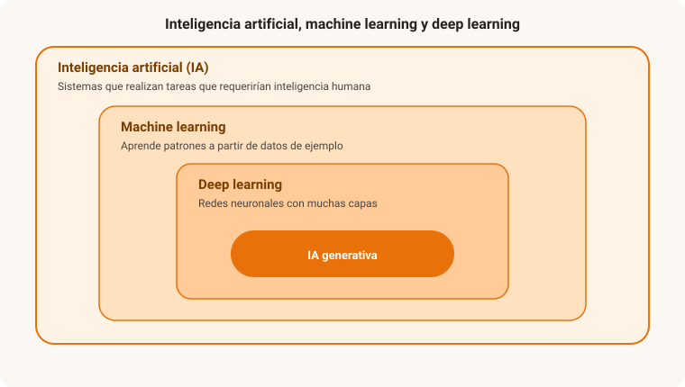
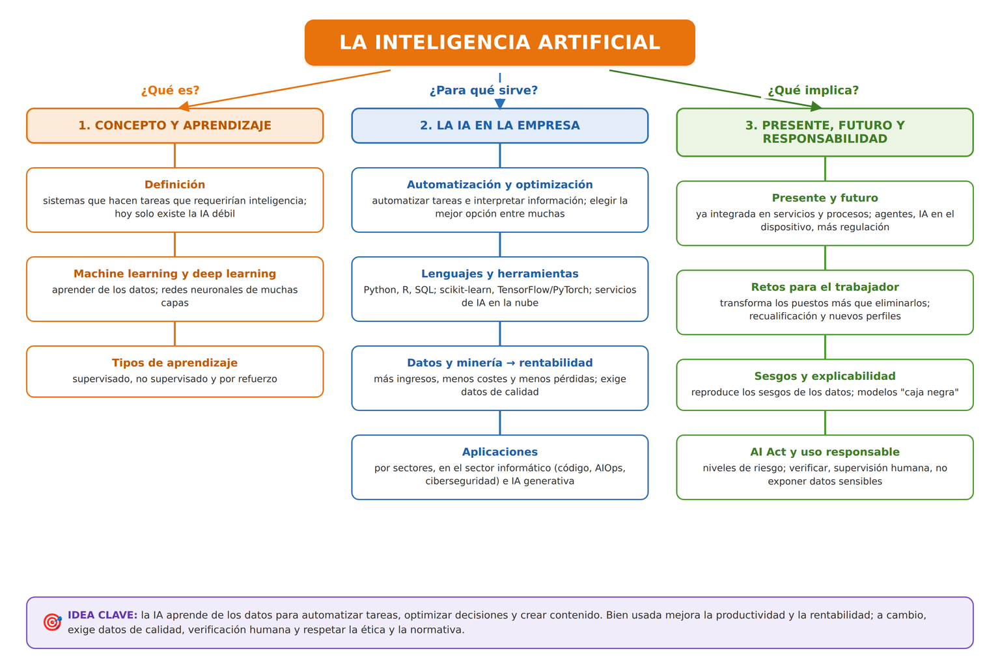

# UD4. Aplicación de la inteligencia artificial

!!! abstract "Resultado de aprendizaje"
    **RA4.** Identifica aplicaciones de la IA (inteligencia artificial) en entornos del sector donde está enmarcado el título describiendo las mejoras implícitas en su implementación.

## 1. Qué es la inteligencia artificial

La **inteligencia artificial (IA)** es la disciplina que desarrolla sistemas capaces de realizar tareas que, si las hiciera una persona, requerirían inteligencia: reconocer imágenes, entender lenguaje natural, tomar decisiones, aprender de la experiencia.

Es útil distinguir dos niveles:

- **IA débil (o estrecha)**: sistemas diseñados para realizar una tarea concreta y específica, aunque lo hagan muy bien (reconocer caras en una foto, recomendar productos, traducir un texto). **Es la única IA que existe hoy en día de forma real y aplicada.**
- **IA fuerte (o general)**: una hipotética inteligencia artificial con capacidad de razonamiento general, comparable o superior a la humana en cualquier tarea intelectual. Es, por ahora, un objetivo teórico y de investigación, no una realidad disponible.

!!! tip "Cuidado con el lenguaje"
    Es habitual atribuir a los sistemas de IA actuales cualidades como "entender" o "pensar". En realidad son sistemas estadísticos muy sofisticados que identifican patrones en enormes cantidades de datos; no tienen consciencia ni comprensión en el sentido humano del término, aunque su comportamiento pueda parecerlo.

### 1.1. Breve contexto histórico

El término "inteligencia artificial" se acuñó en 1956. Desde entonces el campo ha vivido alternancia de fases de gran expectación y fases de estancamiento (los llamados "inviernos de la IA"), hasta el impulso reciente provocado por tres factores que han convergido en la última década: la disponibilidad de enormes volúmenes de datos (Big Data, UD2), la capacidad de cómputo necesaria para procesarlos (impulsada en buena parte por la computación en la nube, UD3) y avances en las técnicas de aprendizaje automático.

!!! question "💡 Comprueba que lo has entendido"
    Un titular dice: "Nueva IA capaz de traducir 100 idiomas, jugar al ajedrez y conducir un coche, todo con el mismo sistema y razonando como una persona".

    **¿Describe IA débil o IA fuerte? ¿Por qué conviene dudar del titular?**

??? note "Ver respuesta"
    Tal como se plantea (un único sistema que razona en cualquier tarea) sería **IA fuerte**, que **hoy no existe**: es un objetivo teórico. Lo realista es que se trate de varios sistemas de **IA débil**, cada uno especializado en una tarea concreta.

## 2. Machine learning y deep learning

- **Aprendizaje automático (*machine learning*)**: en lugar de programar explícitamente todas las reglas de un sistema, se le proporcionan datos de ejemplo para que "aprenda" a partir de ellos los patrones necesarios para resolver una tarea.
- **Aprendizaje profundo (*deep learning*)**: subconjunto del aprendizaje automático basado en redes neuronales artificiales con muchas capas, inspiradas de forma simplificada en el funcionamiento del cerebro. Es la técnica que ha impulsado los avances más recientes, especialmente en reconocimiento de imágenes, voz y generación de lenguaje.

<figure markdown="span">
  { width="700" }
  <figcaption>El aprendizaje profundo es un subconjunto del aprendizaje automático, que a su vez es una rama de la inteligencia artificial; la IA generativa se apoya en el aprendizaje profundo.</figcaption>
</figure>

### 2.1. Tipos de aprendizaje automático

| Tipo | Cómo funciona | Ejemplo |
|---|---|---|
| **Supervisado** | Se entrena con datos ya etiquetados (entrada + resultado correcto conocido) | Clasificar un correo como spam o no spam, a partir de miles de correos ya etiquetados |
| **No supervisado** | Se entrena con datos sin etiquetar; el sistema busca patrones o agrupaciones por sí mismo | Segmentar clientes en grupos según su comportamiento de compra |
| **Por refuerzo** | El sistema aprende por ensayo y error, recibiendo una recompensa o penalización según el resultado de sus acciones | Un sistema que aprende a jugar a un videojuego, o un robot que aprende a caminar |

!!! question "💡 Comprueba que lo has entendido"
    Clasifica el tipo de aprendizaje automático de cada caso:

    1. Un sistema separa a los clientes en grupos de comportamiento sin que nadie le diga cuántos grupos hay ni cuáles.
    2. Un modelo aprende a detectar fugas en una tubería a partir de miles de lecturas ya marcadas como "fuga" / "normal".
    3. Un brazo robótico aprende a apilar cajas mejorando tras cada intento según lo bien que le sale.

??? note "Ver respuesta"
    1. **No supervisado** — busca agrupaciones por sí mismo, sin etiquetas.
    2. **Supervisado** — se entrena con datos etiquetados (entrada + resultado correcto).
    3. **Por refuerzo** — aprende por ensayo y error con recompensa o penalización.

## 3. La IA en la automatización y la optimización de procesos

Dos usos muy extendidos de la IA en las empresas son **automatizar** tareas que antes requerían intervención humana y **optimizar** decisiones que antes se tomaban "a ojo".

**Automatización inteligente.** La RPA (UD2) automatiza tareas repetitivas siguiendo reglas fijas; al combinarla con IA, el sistema puede además **interpretar** información no estructurada y **decidir**:

- Leer facturas, contratos o correos y extraer los datos clave (procesamiento de lenguaje natural, visión artificial).
- Clasificar y enrutar solicitudes, tickets o incidencias.
- Responder consultas frecuentes mediante asistentes conversacionales.
- Detectar anomalías (fraude, fallos) y lanzar una alerta o una acción.

Cuando se encadenan varias de estas piezas para automatizar un proceso de principio a fin se habla de **hiperautomatización**.

**Optimización.** La IA busca la mejor combinación entre muchísimas posibles:

- Rutas de reparto y planificación de flotas.
- Niveles de inventario y previsión de demanda.
- Consumo de energía en edificios o plantas.
- Planificación de la producción y de los turnos.
- Precios dinámicos.

**Mejoras que aporta**: menos tiempo y menos errores, disponibilidad 24/7, liberar a las personas de tareas rutinarias para dedicarlas a otras de más valor, y decisiones basadas en datos en lugar de en intuición.

!!! question "💡 Comprueba que lo has entendido"
    Un ayuntamiento usa un sistema que lee las instancias presentadas, extrae los datos, comprueba si falta documentación y responde automáticamente a las más sencillas. Además, otro sistema decide cada día el recorrido de los camiones de recogida de residuos para gastar el menor combustible posible.

    **¿Cuál de los dos casos es automatización y cuál es optimización?**

??? note "Ver respuesta"
    - Leer instancias, extraer datos y responder a las sencillas es **automatización inteligente** (interpreta información no estructurada y ejecuta una tarea que hacía una persona).
    - Decidir el recorrido de menor consumo entre todas las rutas posibles es **optimización** (elige la mejor combinación según un objetivo).

## 4. Herramientas para trabajar con IA: lenguajes y plataformas

Desarrollar soluciones de IA no exige partir de cero: existe un ecosistema maduro de lenguajes, librerías y servicios.

**Lenguajes de programación más usados en IA:**

- **Python**: es el lenguaje dominante en IA y ciencia de datos, por su sintaxis sencilla y su enorme ecosistema de librerías.
- **R**: muy utilizado en estadística y análisis de datos.
- **SQL**: imprescindible para extraer y preparar los datos guardados en bases de datos.
- Según el contexto: **Julia** (cálculo científico), **C++** o **Java** cuando se necesita rendimiento o integración con sistemas existentes, y **JavaScript** para ejecutar modelos en el navegador.

**Librerías y *frameworks* habituales (en Python):**

- **scikit-learn**: aprendizaje automático "clásico" (clasificación, regresión, *clustering*).
- **TensorFlow** y **PyTorch**: aprendizaje profundo (redes neuronales).
- **pandas** y **NumPy**: manipulación y cálculo con datos.
- **Matplotlib** y similares: visualización.

**Plataformas y servicios:**

- **Servicios de IA en la nube** (UD3): visión, lenguaje, voz o modelos generativos accesibles mediante API, sin entrenar nada.
- **Entornos de trabajo**: *notebooks* (Jupyter, Google Colab) para experimentar con datos y modelos.
- **Herramientas *no-code* / *low-code***: permiten crear modelos sencillos sin programar, subiendo un conjunto de datos o combinando bloques.

!!! question "💡 Comprueba que lo has entendido"
    Un equipo quiere prototipar rápidamente un modelo que prediga la rotación de clientes a partir de una tabla de datos, y necesita también consultar y cruzar esos datos desde la base de datos corporativa.

    **¿Qué lenguaje y qué tipo de herramienta encajarían mejor?**

??? note "Ver respuesta"
    **Python** con una librería de aprendizaje automático (por ejemplo, scikit-learn) sobre un *notebook* para prototipar con rapidez, y **SQL** para extraer y cruzar los datos de la base de datos corporativa.

## 5. IA, datos y minería de datos: rentabilidad para la empresa

La IA **no funciona sin datos**: aprende de ellos. Por eso va siempre unida al **Big Data** (UD2) y a la **minería de datos**.

- **Minería de datos (*data mining*)**: conjunto de técnicas para descubrir patrones, relaciones y tendencias útiles dentro de grandes volúmenes de datos (reglas de asociación, agrupamiento, detección de anomalías, árboles de decisión). Es la "materia prima" sobre la que después se construyen los modelos de IA.
- Flujo habitual: **datos** (IoT, transacciones, web, CRM) → **preparación y minería** → **modelo de IA** → **decisión o acción** → nuevos datos que realimentan el proceso.

**Cómo se traduce en rentabilidad:**

- **Más ingresos**: recomendaciones personalizadas, segmentación de clientes, previsión de demanda, precios óptimos y fidelización (predecir qué cliente va a abandonar).
- **Menos costes**: mantenimiento predictivo, optimización de rutas e inventario, automatización de tareas, menos errores y devoluciones.
- **Menos pérdidas**: detección de fraude y de impagos, control de calidad.
- **Mejores decisiones**: cuadros de mando predictivos en lugar de informes que solo miran al pasado.

La **calidad de los datos** es decisiva: datos incompletos o sesgados producen modelos poco fiables (*garbage in, garbage out*). La evaluación de la calidad del dato se trabaja en la UD5.

!!! question "💡 Comprueba que lo has entendido"
    Una tienda online implanta un modelo que analiza el histórico de compras y navegación para: (a) recomendar productos a cada cliente y (b) avisar de qué clientes tienen alta probabilidad de dejar de comprar.

    **¿Por qué vías se espera que esto mejore la rentabilidad?**

??? note "Ver respuesta"
    Sobre todo por la vía de **más ingresos**: las recomendaciones personalizadas aumentan las ventas cruzadas, y anticipar el abandono permite actuar (ofertas, atención) para **fidelizar** antes de perder al cliente. Todo ello se apoya en la **minería** del histórico de datos.

## 6. Aplicaciones de la IA por sectores

Conectando con la digitalización sectorial vista en la UD1:

- **Industria**: control de calidad automatizado mediante visión artificial (detectar defectos en piezas), mantenimiento predictivo (analizando los datos generados por sensores IoT).
- **Salud**: apoyo al diagnóstico mediante análisis de imágenes médicas, predicción de riesgo de determinadas enfermedades, optimización de la gestión de listas de espera.
- **Atención al cliente**: chatbots y asistentes virtuales que resuelven consultas frecuentes, sistemas de recomendación personalizados en comercio electrónico.
- **Educación**: sistemas de tutoría adaptativa que ajustan el ritmo y la dificultad de los contenidos a cada estudiante, corrección automática de ejercicios.
- **Administración pública**: automatización de la tramitación de expedientes sencillos, detección de fraude en subvenciones o prestaciones, chatbots de atención ciudadana.
- **Transporte y logística**: optimización de rutas, mantenimiento predictivo de flotas, sistemas de conducción asistida o autónoma.

!!! question "💡 Comprueba que lo has entendido"
    Una fábrica quiere que una cámara revise cada pieza en la cinta y aparte las que tengan defectos.

    **¿Qué técnica de IA se está aplicando y a qué mejora concreta da lugar?**

??? note "Ver respuesta"
    **Visión artificial** (aprendizaje profundo aplicado a imágenes) para **control de calidad automatizado**: detecta defectos de forma continua, más rápido y sin la fatiga de la inspección manual, reduciendo las piezas defectuosas que llegan al cliente.

## 7. La IA en el sector informático (el sector del título)

En el propio ámbito de la **administración de sistemas y las redes**, la IA se ha convertido en una herramienta de trabajo cotidiana:

- **Asistentes de programación**: generan, completan y explican código, ayudan a depurar y a escribir pruebas o documentación.
- **AIOps (operaciones de TI con IA)**: análisis automático de *logs* y métricas para detectar incidencias antes de que afecten al servicio, correlacionar alertas y sugerir la causa raíz.
- **Ciberseguridad**: detección de intrusiones y de comportamiento anómalo en la red, filtrado de *phishing* y *spam*, priorización de vulnerabilidades (véase UD2).
- **Automatización de la administración de sistemas**: generación de *scripts* y de ficheros de configuración, gestión predictiva de capacidad y de copias, respuesta automática a eventos.
- **Soporte y *service desk***: *chatbots* que resuelven incidencias frecuentes y guían al usuario; clasificación y enrutado automático de *tickets*.
- **Pruebas y calidad del software**: generación de casos de prueba, detección de regresiones.

**Mejoras en los procesos de trabajo**: menos tiempo en tareas repetitivas, menos errores de configuración, respuesta más rápida a incidencias y más margen para el diseño y la mejora. La contrapartida: hay que **revisar** lo que produce la IA (código, configuraciones) y no perder el criterio técnico propio.

!!! question "💡 Comprueba que lo has entendido"
    En un departamento de sistemas, la IA sugiere el *script* de despliegue, resume cada noche miles de líneas de *log* y avisa de patrones de tráfico anómalos en la red.

    **Asocia cada uso con su categoría (asistente de programación, AIOps, ciberseguridad) e indica una precaución común a los tres.**

??? note "Ver respuesta"
    - Sugerir el *script* de despliegue → **asistente de programación**.
    - Resumir los *logs* y detectar incidencias → **AIOps**.
    - Avisar de tráfico anómalo → **ciberseguridad**.
    - Precaución común: **revisar y validar** la salida de la IA antes de aplicarla; el criterio técnico sigue siendo del profesional.

## 8. IA generativa

La **IA generativa** agrupa a los modelos capaces de crear contenido nuevo (texto, imágenes, audio, vídeo o código) en lugar de limitarse a clasificar o predecir sobre datos ya existentes. Es, con diferencia, el ámbito de la IA que más ha impactado en el uso cotidiano en los últimos años.

- **Modelos de lenguaje (LLM — *Large Language Models*)**: entrenados con enormes cantidades de texto, son capaces de generar texto coherente, responder preguntas, resumir documentos, traducir o incluso escribir código. Los asistentes conversacionales (*chatbots* basados en IA) son la aplicación más visible de estos modelos.
- **Generación de imágenes**: modelos capaces de crear imágenes a partir de una descripción textual.
- **Generación de audio y vídeo**: síntesis de voz realista, clonación de voz, generación o edición de vídeo.
- **Generación de código**: asistentes que ayudan a programadores a escribir, completar o depurar código.

!!! reto "Reto: pon a prueba un asistente de IA generativa"
    Usa un asistente conversacional basado en IA para realizar una tarea concreta relacionada con tus estudios (por ejemplo, que te explique un concepto técnico, o que te ayude a estructurar un documento). Anota: ¿la respuesta fue correcta al 100%? ¿Detectaste algún error o "invención" (lo que se conoce como *alucinación*)? ¿Cómo verificarías la información antes de darla por buena?

!!! question "💡 Comprueba que lo has entendido"
    Un sistema recibe la frase "un faro rojo sobre un acantilado al atardecer" y devuelve una imagen nueva que encaja con esa descripción.

    **¿Es IA generativa o IA "tradicional" de clasificación/predicción? ¿Por qué?**

??? note "Ver respuesta"
    Es **IA generativa**: crea contenido nuevo (una imagen que no existía) a partir de una descripción, en lugar de limitarse a clasificar o predecir sobre datos ya existentes. Se apoya en el aprendizaje profundo.

### 8.1. Limitaciones de la IA generativa

- **Alucinaciones**: los modelos pueden generar información que suena plausible pero es incorrecta o directamente inventada, presentada con total seguridad.
- **Desactualización**: un modelo entrenado con datos hasta una fecha determinada no conoce, por defecto, información posterior a ese momento.
- **Falta de razonamiento verificable**: el modelo no "comprueba" hechos como lo haría una persona consultando fuentes; genera la respuesta estadísticamente más probable según sus datos de entrenamiento.

Por ello, un principio fundamental en el uso profesional de la IA generativa es la **verificación humana** de sus resultados, especialmente en información crítica.

!!! question "💡 Comprueba que lo has entendido"
    Un asistente de IA generativa responde a una consulta legal citando una sentencia con número, fecha y tribunal... que no existe.

    **¿Qué limitación de la IA generativa ilustra este caso y qué práctica lo habría evitado?**

??? note "Ver respuesta"
    Una **alucinación**: información plausible pero inventada, presentada con seguridad (unida a la **falta de razonamiento verificable**: el modelo no consulta fuentes, genera la respuesta más probable). Lo habría evitado la **verificación humana** de la respuesta contra fuentes fiables antes de utilizarla.

## 9. Importancia presente y futura de la IA. Retos para el trabajador

**Presente.** La IA ya está integrada en servicios de uso diario (buscadores, traductores, recomendadores, asistentes, filtros antifraude) y en procesos de empresa de todos los sectores. La irrupción de la **IA generativa** (apartado 8) la ha puesto al alcance de cualquier persona sin perfil técnico.

**Futuro (tendencias):**

- **IA más presente y "invisible"**, integrada dentro de las herramientas que ya se usan.
- **Agentes de IA** que no solo responden, sino que ejecutan tareas de varios pasos con cierta autonomía.
- **IA en el dispositivo** (*edge*, UD3): modelos que funcionan en el móvil o en la máquina, sin enviar los datos a la nube.
- **Más regulación y exigencia de transparencia** (apartado 10).
- Debate abierto sobre **consumo energético**, propiedad intelectual y fiabilidad.

**Retos para el trabajador:**

- **Transformación de los puestos, más que desaparición**: la IA automatiza *tareas*, no siempre profesiones enteras; muchos empleos cambian de contenido.
- **Recualificación permanente (*reskilling* y *upskilling*)**: saber usar herramientas de IA y trabajar *con* ellas se convierte en una competencia básica.
- **Nuevos perfiles**: ingeniería de datos, entrenamiento y supervisión de modelos, auditoría de algoritmos, integración de servicios de IA.
- **Competencias que ganan valor**: criterio para verificar resultados, pensamiento crítico, comunicación, creatividad y trato con personas.
- **Riesgos a vigilar**: pérdida de cualificación por delegar en exceso, vigilancia laboral mediante IA y la **brecha** entre quienes saben aprovecharla y quienes no.

!!! question "💡 Comprueba que lo has entendido"
    Ante la llegada de la IA generativa a su empresa, una persona teme que su puesto "desaparezca de un día para otro".

    **Da una visión más matizada y una acción concreta que pueda tomar.**

??? note "Ver respuesta"
    Lo habitual es que la IA automatice **tareas** dentro del puesto, no el puesto entero: el trabajo se **transforma** y gana peso lo que la IA no hace bien (criterio, verificación, trato con personas). Acción concreta: **formarse** en el uso de esas herramientas (*upskilling*) para incorporarlas a su trabajo en lugar de competir con ellas.

## 10. Ética y regulación de la inteligencia artificial

### 10.1. Sesgos algorítmicos

Un sistema de IA aprende de los datos con los que se entrena. Si esos datos reflejan sesgos históricos o sociales (por ejemplo, discriminación pasada en procesos de contratación), el sistema puede **reproducir e incluso amplificar** esos sesgos, aunque no exista intención discriminatoria por parte de quien lo desarrolla. Es un riesgo especialmente relevante en aplicaciones como la selección de personal, la concesión de créditos o la valoración de riesgo penal.

!!! question "💡 Comprueba que lo has entendido"
    Un banco entrena un modelo de concesión de créditos con su histórico de decisiones de los últimos 20 años, en los que apenas se concedieron préstamos en un determinado barrio.

    **¿Qué problema es previsible y por qué no basta con "no incluir la variable barrio"?**

??? note "Ver respuesta"
    El modelo **reproducirá el sesgo histórico**: aprenderá a rechazar perfiles parecidos a los que ya se rechazaron. Aunque se elimine la variable "barrio", otras variables correlacionadas (código postal, ingresos, etc.) actúan como *proxy*, así que hay que auditar los datos y los resultados, no solo quitar un campo.

### 10.2. Transparencia y explicabilidad

Muchos modelos de IA, especialmente los basados en *deep learning*, funcionan como "cajas negras": es difícil explicar exactamente por qué han llegado a una conclusión concreta. Esto plantea problemas cuando la IA se usa para tomar decisiones que afectan a derechos de las personas (por ejemplo, denegar un préstamo), donde suele exigirse poder explicar el motivo de la decisión.

### 10.3. El Reglamento europeo de Inteligencia Artificial (AI Act)

La Unión Europea ha aprobado un reglamento específico para regular el desarrollo y uso de sistemas de IA, que clasifica los sistemas según su **nivel de riesgo**:

- **Riesgo inaceptable**: sistemas prohibidos por vulnerar derechos fundamentales (por ejemplo, sistemas de puntuación social por parte de gobiernos, o determinadas formas de manipulación subliminal).
- **Riesgo alto**: sistemas usados en ámbitos sensibles (selección de personal, evaluación crediticia, infraestructuras críticas, sistemas relacionados con procesos judiciales o educativos), sujetos a requisitos estrictos de transparencia, supervisión humana y gestión de riesgos.
- **Riesgo limitado**: sistemas sujetos sobre todo a obligaciones de transparencia (por ejemplo, informar a la persona usuaria de que está interactuando con un chatbot, o de que un contenido ha sido generado o manipulado por IA).
- **Riesgo mínimo o nulo**: la mayoría de aplicaciones actuales (filtros antispam, videojuegos con IA), sin requisitos específicos adicionales.

!!! question "💡 Comprueba que lo has entendido"
    Clasifica según el nivel de riesgo del AI Act:

    1. Un sistema de puntuación social de la ciudadanía implantado por un gobierno y que condiciona sus derechos.
    2. Un sistema que criba currículums para preseleccionar candidatos a un puesto.
    3. Un chatbot de una tienda online que debe avisar de que no se está hablando con una persona.

??? note "Ver respuesta"
    1. **Riesgo inaceptable** — puntuación social; está prohibido.
    2. **Riesgo alto** — selección de personal; requisitos estrictos de transparencia, supervisión humana y gestión de riesgos.
    3. **Riesgo limitado** — sujeto sobre todo a obligaciones de transparencia.

## 11. IA responsable en el entorno profesional

Algunas buenas prácticas para el uso profesional de herramientas de IA:

- **Verificar siempre** la información generada antes de utilizarla, especialmente en contextos con consecuencias reales.
- **No introducir datos confidenciales o personales** en herramientas de IA generativa de terceros sin conocer su política de tratamiento de datos (conecta con la protección de datos que se estudia en la UD5).
- **Ser transparente** sobre el uso de IA cuando afecte a terceros (por ejemplo, indicar si un contenido ha sido generado o asistido por IA, cuando sea relevante).
- **Mantener supervisión humana** en decisiones importantes, evitando delegar por completo la responsabilidad en el sistema automático.
- **Respetar la propiedad intelectual**, tanto de los materiales usados para entrenar o alimentar un sistema de IA como del contenido que este genera, cuya titularidad y derechos de uso pueden estar sujetos a condiciones específicas.

!!! question "💡 Comprueba que lo has entendido"
    Un empleado pega en un chatbot de IA de terceros el listado de clientes con sus datos de contacto para que le redacte un correo comercial, y envía el texto resultante sin revisarlo.

    **¿Qué dos buenas prácticas de uso responsable de la IA está incumpliendo?**

??? note "Ver respuesta"
    - **No introducir datos personales o confidenciales** en herramientas de terceros sin conocer su política de tratamiento de datos (conecta con la protección de datos de la UD5).
    - **Verificar siempre** el resultado y mantener supervisión humana antes de usarlo, en lugar de delegar por completo en el sistema.

---

## Actividades

**Actividad 4.1 — Clasifica el tipo de aprendizaje**

Para cada uno de estos casos, indica si el aprendizaje automático empleado sería supervisado, no supervisado o por refuerzo, y justifica tu respuesta: (a) un sistema que agrupa noticias similares sin que nadie le haya dicho previamente las categorías; (b) un sistema que aprende a jugar al ajedrez jugando miles de partidas contra sí mismo; (c) un sistema que detecta tumores en radiografías entrenado con miles de imágenes ya diagnosticadas por especialistas.

**Actividad 4.2 — Detecta una alucinación**

Pide a un asistente de IA generativa información muy específica sobre un tema que conozcas bien (una fecha, un dato técnico, una referencia bibliográfica). Comprueba si la respuesta es exacta. Si detectas un error, descríbelo y reflexiona sobre qué riesgo tendría no haberlo verificado.

**Actividad 4.3 — Nivel de riesgo según el AI Act**

Clasifica cada uno de estos sistemas de IA según los niveles de riesgo del Reglamento europeo de IA (inaceptable, alto, limitado o mínimo): un filtro de spam en el correo; un sistema que evalúa currículums para preseleccionar candidatos a un puesto de trabajo; un chatbot de atención al cliente de una tienda online; un sistema de puntuación social obligatorio implantado por un gobierno.

## Mapa conceptual

<figure markdown="span">
  { width="960" }
  <figcaption>Síntesis de la unidad: la inteligencia artificial se aborda desde su <strong>concepto y aprendizaje</strong> (definición, IA débil y fuerte, <em>machine learning</em> y <em>deep learning</em>, tipos de aprendizaje), <strong>la IA en la empresa</strong> (automatización y optimización de procesos, lenguajes y herramientas, datos y minería para la rentabilidad, aplicaciones por sectores y en el sector informático, IA generativa) y su <strong>presente, futuro y responsabilidad</strong> (importancia y tendencias, retos para el trabajador, sesgos y explicabilidad, AI Act y uso responsable).</figcaption>
</figure>

## Autoevaluación

??? question "1. ¿Qué diferencia hay entre IA débil e IA fuerte?"
    La IA débil está diseñada para realizar una tarea específica y es la única que existe realmente hoy en día. La IA fuerte sería una inteligencia artificial con capacidad de razonamiento general comparable a la humana en cualquier tarea; por ahora es solo un objetivo teórico, no una realidad disponible.

??? question "2. ¿Qué es el aprendizaje profundo (*deep learning*)?"
    Un subconjunto del aprendizaje automático basado en redes neuronales artificiales con muchas capas, que ha impulsado los avances recientes en reconocimiento de imágenes, voz y generación de lenguaje.

??? question "3. ¿Qué es una 'alucinación' en el contexto de la IA generativa?"
    Cuando un modelo genera información que suena plausible pero es incorrecta o inventada, presentándola con aparente seguridad, sin que exista intención de engañar por su parte: es una limitación técnica del propio modelo.

??? question "4. ¿Por qué pueden aparecer sesgos en un sistema de IA aunque no haya intención discriminatoria por parte de quien lo desarrolla?"
    Porque el sistema aprende de los datos con los que se entrena; si esos datos reflejan sesgos históricos o sociales, el modelo tiende a reproducirlos e incluso amplificarlos.

??? question "5. Según el Reglamento europeo de IA, ¿en qué categoría de riesgo se sitúan los sistemas usados en selección de personal o evaluación crediticia?"
    En la categoría de riesgo alto, sujeta a requisitos estrictos de transparencia, supervisión humana y gestión de riesgos.

??? question "6. ¿Qué relación hay entre inteligencia artificial, *machine learning* y *deep learning*?"
    Son conjuntos anidados: el aprendizaje automático (*machine learning*) es una rama de la inteligencia artificial, y el aprendizaje profundo (*deep learning*) es a su vez un subconjunto del aprendizaje automático, basado en redes neuronales con muchas capas.

??? question "7. Diferencia entre aprendizaje supervisado y no supervisado."
    En el supervisado se entrena con datos etiquetados (cada entrada lleva asociado su resultado correcto), por ejemplo para clasificar correos como spam. En el no supervisado los datos no están etiquetados y el sistema busca por sí mismo patrones o agrupaciones, por ejemplo para segmentar clientes.

??? question "8. ¿Por qué es imprescindible la verificación humana al usar IA generativa?"
    Porque el modelo puede generar alucinaciones (información plausible pero falsa), puede estar desactualizado y no comprueba los hechos consultando fuentes: genera la respuesta estadísticamente más probable. En información crítica, un error sin verificar puede tener consecuencias reales.

??? question "9. ¿Qué tipo de sistemas de IA se consideran de "riesgo inaceptable" en el AI Act?"
    Los que vulneran derechos fundamentales y por ello están prohibidos, como los sistemas de puntuación social por parte de gobiernos o determinadas formas de manipulación subliminal.

??? question "10. ¿Qué diferencia hay entre usar la IA para automatizar y usarla para optimizar un proceso?"
    Automatizar es hacer que el sistema ejecute por sí mismo una tarea que antes hacía una persona (leer un documento y extraer datos, responder una consulta). Optimizar es elegir la mejor opción entre muchas posibles según un objetivo (la ruta de menor consumo, el nivel de inventario que minimiza coste).

??? question "11. Cita el lenguaje de programación más usado en IA y dos librerías habituales."
    **Python**. Librerías habituales: scikit-learn (aprendizaje automático clásico), TensorFlow y PyTorch (aprendizaje profundo), pandas y NumPy (datos). También R y SQL son frecuentes en el trabajo con datos.

??? question "12. ¿Qué es la minería de datos y cómo se relaciona con la rentabilidad de la empresa?"
    Es el conjunto de técnicas para descubrir patrones y tendencias útiles en grandes volúmenes de datos. Alimenta a los modelos de IA que mejoran la rentabilidad por varias vías: más ingresos (recomendación, previsión de demanda, fidelización), menos costes (mantenimiento predictivo, optimización, automatización) y menos pérdidas (detección de fraude, control de calidad).

??? question "13. Pon dos ejemplos de uso de la IA en el sector informático."
    Por ejemplo: asistentes de programación que generan y explican código; AIOps para analizar *logs* y detectar incidencias antes de que afecten al servicio; detección de intrusiones y de *phishing* en ciberseguridad; *chatbots* de soporte y clasificación de *tickets*; generación de *scripts* y de configuración.

??? question "14. ¿Por qué se dice que la IA transforma los puestos de trabajo más que hacerlos desaparecer? Cita un reto para el trabajador."
    Porque la IA automatiza tareas concretas dentro de un puesto, no siempre la profesión entera: el contenido del trabajo cambia y gana peso lo que la IA no hace bien (criterio, verificación, trato con personas). Un reto: la **recualificación permanente** (*reskilling* y *upskilling*) para aprender a trabajar con estas herramientas.
