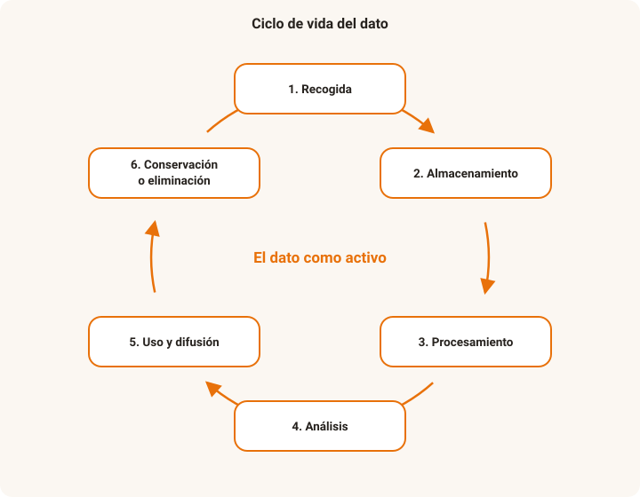
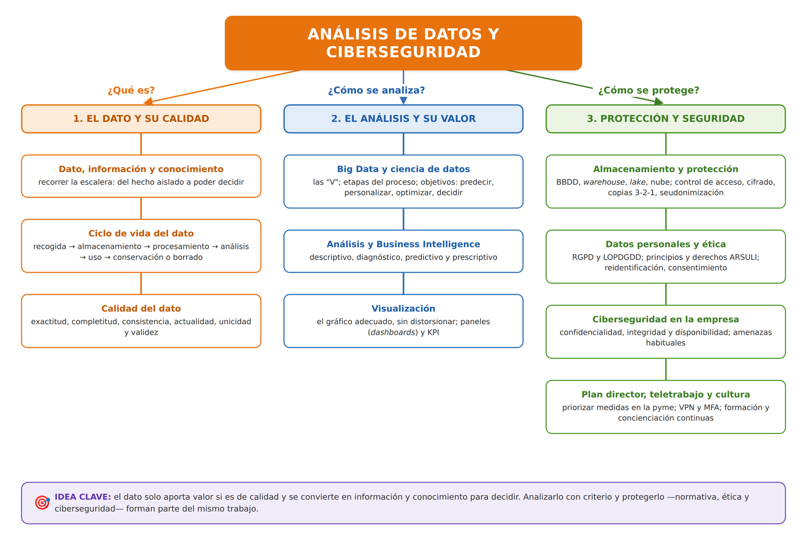

# UD5. Análisis de datos y ciberseguridad

!!! abstract "Resultado de aprendizaje"
    **RA5.** Evalúa la importancia de los datos, así como su protección en una economía digital globalizada, definiendo sistemas de seguridad y ciberseguridad tanto a nivel de equipo/sistema, como globales.

## 1. El dato como activo

En una organización digitalizada, el **dato** se ha convertido en un activo con valor propio, comparable al de otros recursos económicos: se genera, se almacena, se procesa, se protege y, sobre todo, se utiliza para tomar decisiones. Pero un dato solo tiene valor real si se puede confiar en él: un dato incorrecto puede llevar a una decisión equivocada con más facilidad que la ausencia total de datos, precisamente porque transmite una falsa sensación de certeza.

Esta unidad se centra en cómo **analizar y proteger** los datos: su calidad, cómo se analizan y visualizan para apoyar decisiones, las obligaciones legales y éticas que implica su tratamiento —en particular cuando se trata de datos personales— y las medidas de ciberseguridad que los mantienen a salvo.

### 1.1. Dato, información y conocimiento

Conviene distinguir tres niveles:

- **Dato**: un hecho aislado, sin contexto ni interpretación ("18", "Madrid", "02/09/2026").
- **Información**: datos organizados y puestos en contexto, de modo que responden a una pregunta ("ayer la temperatura media en Madrid fue de 18 °C").
- **Conocimiento**: información interpretada y combinada con la experiencia, que permite actuar ("en septiembre baja la demanda de aire acondicionado en Madrid; conviene reducir el stock").

Analizar datos consiste precisamente en **recorrer esa escalera**: convertir datos en información y la información en conocimiento útil para decidir. Un dato aislado no vale casi nada; su valor aparece al relacionarlo con otros datos y con un objetivo.

!!! question "💡 Comprueba que lo has entendido"
    Clasifica cada elemento como dato, información o conocimiento:

    1. "1.240".
    2. "En marzo se registraron 1.240 incidencias, un 30 % más que en febrero".
    3. "Las incidencias suben cada vez que hay un despliegue en viernes, así que conviene evitarlos".

??? note "Ver respuesta"
    1. **Dato** — un número sin contexto.
    2. **Información** — el dato en contexto, comparado y con significado.
    3. **Conocimiento** — un patrón interpretado que permite decidir cómo actuar.

### 1.2. Ciclo de vida del dato

1. **Recogida**: captación del dato en origen (formularios, sensores IoT, transacciones, interacciones web).
2. **Almacenamiento**: en bases de datos, hojas de cálculo, *data lakes* o *data warehouses* (véase UD2).
3. **Procesamiento**: limpieza, transformación y combinación de datos de distintas fuentes.
4. **Análisis**: aplicación de técnicas estadísticas o de aprendizaje automático (véase UD4) para extraer conclusiones.
5. **Uso y difusión**: presentación de resultados (informes, paneles) y toma de decisiones basada en ellos.
6. **Conservación o eliminación**: los datos deben conservarse solo el tiempo necesario según su finalidad y la normativa aplicable, y eliminarse de forma segura cuando ya no proceda conservarlos.

<figure markdown="span">
  { width="640" }
  <figcaption>Las seis fases del ciclo de vida del dato se encadenan de forma continua: la conservación o eliminación cierra el ciclo y la recogida de nuevos datos lo reinicia.</figcaption>
</figure>

!!! question "💡 Comprueba que lo has entendido"
    Una empresa conserva desde hace diez años todos los currículums que ha recibido, "por si acaso", sin haberlos vuelto a mirar.

    **¿Qué fase del ciclo de vida del dato está gestionando mal y qué debería hacer?**

??? note "Ver respuesta"
    La fase de **conservación o eliminación**: los datos solo deben guardarse el tiempo necesario para su finalidad y la normativa aplicable. Debería **eliminar de forma segura** los currículums que ya no tienen una finalidad vigente.

## 2. Calidad del dato

Antes de analizar cualquier dato hay que preguntarse si es fiable. Las principales dimensiones de la **calidad del dato** son:

| Dimensión | Qué evalúa | Ejemplo de problema |
|---|---|---|
| **Exactitud** | Si el dato refleja fielmente la realidad | Una dirección postal mal escrita |
| **Completitud** | Si faltan datos que deberían estar presentes | Un formulario con el campo "teléfono" vacío en el 40% de los registros |
| **Consistencia** | Si el mismo dato se representa igual en distintos sistemas | Un mismo cliente registrado como "Juan Pérez" en un sistema y "J. Pérez García" en otro |
| **Actualidad** | Si el dato sigue siendo válido en el momento de usarlo | Un stock de almacén que no refleja las ventas del último día |
| **Unicidad** | Si existen registros duplicados | El mismo cliente dado de alta dos veces con datos ligeramente distintos |
| **Validez** | Si el dato cumple el formato o rango esperado | Una fecha de nacimiento en el futuro, o una edad de 250 años |

!!! reto "Reto: audita un conjunto de datos"
    Consigue (o te proporcionará el/la docente) una pequeña hoja de cálculo con datos de ejemplo que contenga errores intencionados. Identifica al menos un problema de cada una de las dimensiones de calidad anteriores.

### 2.1. Consecuencias de una mala calidad del dato

Una mala calidad del dato no es solo un problema técnico: tiene consecuencias organizativas y económicas — decisiones erróneas basadas en cifras poco fiables, pérdida de tiempo y recursos en corregir errores a posteriori, pérdida de confianza de clientes o usuarios, e incluso incumplimientos normativos si los datos personales tratados son incorrectos o están desactualizados.

!!! question "💡 Comprueba que lo has entendido"
    En una tabla de clientes aparece este registro: nombre vacío, "fecha de alta: 30/02/2025", el mismo correo que otro cliente y un teléfono con solo 4 cifras.

    **Asocia cada anomalía con la dimensión de calidad del dato que incumple.**

??? note "Ver respuesta"
    - Nombre vacío → **completitud**.
    - "30/02/2025" (fecha imposible) → **validez**.
    - Correo repetido en otro registro → **unicidad**.
    - Teléfono de 4 cifras → **validez** (formato/rango); si además no es un número real, **exactitud**.

## 3. Big Data y ciencia de datos

Como se introdujo en la UD2, el **Big Data** agrupa las técnicas y la infraestructura necesarias para manejar conjuntos de datos que, por su volumen, velocidad o variedad, superan la capacidad de las herramientas tradicionales. La **ciencia de datos (*data science*)** es la disciplina que se apoya en esa infraestructura para extraer conocimiento útil de los datos, combinando estadística, programación y conocimiento del negocio.

El Big Data se caracteriza por las **"V"**: **volumen** (gran cantidad de datos), **velocidad** (se generan y deben procesarse muy rápido, a veces en tiempo real), **variedad** (formatos estructurados y no estructurados), **veracidad** (fiabilidad) y **valor** (utilidad que se extrae). Cuando un conjunto de datos reúne varias de estas características, las herramientas tradicionales se quedan cortas.

Los **objetivos de la ciencia de datos** en una empresa suelen ser: entender qué ha pasado y por qué, **predecir** lo que va a pasar, **personalizar** productos y servicios, **optimizar** procesos y recursos, **detectar** fraude o anomalías y, en definitiva, **apoyar la toma de decisiones** con evidencia en lugar de con intuición.

### 3.1. Etapas típicas de la ciencia de datos

1. **Definición del problema**: qué pregunta de negocio se quiere responder.
2. **Recogida y preparación de los datos**: captación, limpieza y transformación (conecta directamente con la calidad del dato vista en el punto 2).
3. **Exploración y análisis**: aplicación de técnicas estadísticas para detectar patrones.
4. **Modelado**: cuando el volumen y la complejidad de los datos lo justifican, se recurre a técnicas de **aprendizaje automático (*machine learning*)** y **aprendizaje profundo (*deep learning*)** — vistas en detalle en la UD4 — para construir modelos capaces de clasificar, predecir o agrupar datos de forma automática.
5. **Comunicación de resultados**: presentación de conclusiones mediante visualización (véase el apartado 6) o paneles de control.

!!! tip "Big Data, machine learning y deep learning: cómo encajan"
    El Big Data aporta el volumen y la infraestructura de datos; el machine learning y el deep learning (UD4) son las técnicas que permiten extraer patrones de ese volumen de datos cuando la relación entre variables es demasiado compleja para un análisis estadístico tradicional. Cuantos más datos de calidad estén disponibles, mejor suele funcionar un modelo de aprendizaje automático: por eso ambas tecnologías están tan estrechamente ligadas en la práctica.

### 3.2. Almacenamiento en la nube y ciencia de datos

El procesamiento y almacenamiento de grandes volúmenes de datos rara vez se realiza sobre infraestructura local: el **cloud computing**, estudiado en profundidad en la UD3, ofrece el almacenamiento elástico y el potencial de cómputo bajo demanda que la ciencia de datos necesita, sin obligar a la organización a invertir en infraestructura propia dimensionada para los picos de carga.

!!! question "💡 Comprueba que lo has entendido"
    Un equipo quiere construir un modelo que prediga qué clientes van a darse de baja, a partir de millones de registros de uso.

    **Ordena estas tareas según las etapas de la ciencia de datos: modelar, limpiar los datos, definir la pregunta de negocio, comunicar resultados, explorar patrones.**

??? note "Ver respuesta"
    1. **Definir la pregunta de negocio** (¿quién se dará de baja?).
    2. **Recoger y limpiar los datos** (calidad del dato).
    3. **Explorar y analizar** para detectar patrones.
    4. **Modelar** con aprendizaje automático.
    5. **Comunicar los resultados** (visualización, paneles).

## 4. Almacenamiento y protección de datos

Los datos que una organización acumula hay que **guardarlos** de forma adecuada y **protegerlos** a lo largo de todo su ciclo de vida.

**Dónde se almacenan (aspectos básicos):**

- **Bases de datos relacionales**: datos estructurados en tablas, con relaciones e integridad; es la base de la mayoría de sistemas de gestión.
- **Bases de datos NoSQL**: para datos semiestructurados o no estructurados y grandes volúmenes.
- **Data warehouse**: almacén de datos ya depurados y organizados para el análisis.
- **Data lake**: repositorio de datos en bruto, de cualquier formato, para explotarlos más adelante.
- **Almacenamiento de objetos y de archivos en la nube** (UD3): elástico y con pago por uso; habitual para copias de seguridad, *data lakes* y contenidos.

**Cómo se protegen (aspectos básicos):**

- **Control de acceso**: identificación, autenticación (incluida la de doble factor, MFA) y principio de **mínimo privilegio** (cada persona accede solo a lo que necesita).
- **Cifrado** de los datos **en tránsito** (comunicaciones) y **en reposo** (discos y copias).
- **Copias de seguridad** con versiones y regla **3-2-1** (UD3), con pruebas periódicas de restauración.
- **Seudonimización y anonimización**: sustituir o eliminar los identificadores directos para reducir el daño si los datos se filtran.
- **Registro de actividad (*logs*)** para detectar accesos indebidos y poder investigar incidentes.
- **Borrado seguro** cuando el dato deja de ser necesario, cerrando el ciclo de vida.

!!! question "💡 Comprueba que lo has entendido"
    Una empresa guarda su histórico de ventas para análisis en un almacén de datos depurado, y vuelca los datos en bruto de sus sensores y su web en un repositorio sin estructurar "para lo que haga falta más adelante".

    **¿Cómo se llama cada uno de esos dos almacenes y qué medida mínima de protección debería aplicarse a ambos?**

??? note "Ver respuesta"
    - El almacén depurado para análisis es un **data warehouse**; el repositorio de datos en bruto es un **data lake**.
    - En ambos: **control de acceso con mínimo privilegio** y **cifrado en reposo**, además de **copias de seguridad** probadas.

## 5. Análisis de datos y Business Intelligence

El **Business Intelligence (BI)** o inteligencia de negocio es el conjunto de estrategias, procesos y herramientas orientadas a transformar datos en información útil para la toma de decisiones.

### 5.1. Niveles de análisis de datos

1. **Análisis descriptivo**: ¿qué ha pasado? Resume datos históricos (por ejemplo, ventas del último trimestre por región).
2. **Análisis diagnóstico**: ¿por qué ha pasado? Busca las causas de un fenómeno observado (por ejemplo, por qué han caído las ventas en una región concreta).
3. **Análisis predictivo**: ¿qué es probable que pase? Utiliza datos históricos y técnicas estadísticas o de aprendizaje automático (UD4) para anticipar tendencias futuras.
4. **Análisis prescriptivo**: ¿qué se debería hacer? Va un paso más allá del predictivo, sugiriendo acciones concretas para lograr o evitar un resultado.

!!! question "💡 Comprueba que lo has entendido"
    Clasifica cada pregunta según el nivel de análisis de datos:

    1. "¿Cuántas unidades vendimos el trimestre pasado por región?"
    2. "¿Por qué cayeron las ventas en la zona norte?"
    3. "¿Cuántas ventas esperamos el mes que viene?"
    4. "¿Qué descuento deberíamos aplicar para maximizar el margen?"

??? note "Ver respuesta"
    1. **Descriptivo** — qué ha pasado.
    2. **Diagnóstico** — por qué ha pasado.
    3. **Predictivo** — qué es probable que pase.
    4. **Prescriptivo** — qué se debería hacer.

## 6. Visualización de datos

Presentar los datos de forma visual facilita su interpretación y la detección de patrones que resultan difíciles de ver en una tabla de cifras. Algunos principios básicos:

- **Elegir el tipo de gráfico adecuado al dato**: por ejemplo, un gráfico de líneas para mostrar evolución en el tiempo, un gráfico de barras para comparar categorías, un mapa para datos geográficos.
- **Evitar la sobrecarga visual**: incluir solo la información relevante para el mensaje que se quiere transmitir.
- **No distorsionar la percepción**: por ejemplo, truncar el eje vertical de un gráfico de barras puede exagerar visualmente diferencias que en realidad son pequeñas.
- **Etiquetar con claridad**: unidades, fuente de los datos y fecha de actualización.

Los **paneles de control (*dashboards*)** son la forma más habitual de poner esta visualización al servicio de la toma de decisiones continua en una organización, combinando varios indicadores clave (**KPI — *Key Performance Indicators***) en una sola vista actualizada.

!!! tip "Herramientas habituales"
    Desde hojas de cálculo con tablas y gráficos dinámicos (Excel, Google Sheets), hasta herramientas específicas de BI (Power BI, Tableau, Google Looker Studio) o soluciones *no-code/low-code* que permiten crear paneles sin necesidad de programar.

!!! question "💡 Comprueba que lo has entendido"
    Para comparar las ventas de dos años (100 y 104 millones), alguien hace un gráfico de barras con el eje vertical empezando en 99.

    **¿Qué principio de visualización se está incumpliendo y qué efecto produce?**

??? note "Ver respuesta"
    **No distorsionar la percepción**: truncar el eje vertical hace que una diferencia real del 4% parezca enorme. El eje de un gráfico de barras debería empezar en cero.

## 7. Protección de datos personales

Cuando los datos que se tratan son **datos personales** (información que identifica o permite identificar a una persona física), su tratamiento está sujeto a una normativa específica y estricta.

### 7.1. Marco normativo

- **RGPD** (Reglamento General de Protección de Datos, de aplicación en toda la Unión Europea).
- **LOPDGDD** (Ley Orgánica de Protección de Datos Personales y garantía de los derechos digitales), que desarrolla el RGPD en España.

### 7.2. Principios básicos del tratamiento de datos personales

- **Licitud, lealtad y transparencia**: solo se pueden tratar datos con una base legal (consentimiento, contrato, obligación legal, entre otras) y de forma comprensible para la persona afectada.
- **Limitación de la finalidad**: los datos se recogen para un fin determinado y explícito, y no deben usarse posteriormente para fines incompatibles con ese fin original.
- **Minimización de datos**: solo deben recogerse los datos estrictamente necesarios para la finalidad declarada.
- **Exactitud**: los datos deben mantenerse actualizados y correctos.
- **Limitación del plazo de conservación**: no deben conservarse más tiempo del necesario para la finalidad que justificó su recogida.
- **Integridad y confidencialidad**: deben protegerse mediante medidas técnicas y organizativas adecuadas (cifrado, control de accesos...).
- **Responsabilidad proactiva (*accountability*)**: quien trata los datos debe poder demostrar en todo momento que cumple estos principios.

### 7.3. Derechos de las personas (derechos ARSULI)

| Derecho | En qué consiste |
|---|---|
| **Acceso** | Saber qué datos propios se están tratando y con qué finalidad |
| **Rectificación** | Corregir datos inexactos o incompletos |
| **Supresión** ("derecho al olvido") | Solicitar que se eliminen los datos propios, cuando proceda |
| **Limitación** | Solicitar que se restrinja temporalmente el tratamiento de los datos, sin eliminarlos |
| **Portabilidad** | Recibir los datos propios en un formato estructurado para poder trasladarlos a otro proveedor |
| **Oposición** | Oponerse a un tratamiento concreto de los datos propios (por ejemplo, con fines de marketing) |

### 7.4. Datos especialmente protegidos

El RGPD establece una categoría de **datos especialmente sensibles** que requieren garantías reforzadas: origen étnico o racial, opiniones políticas, convicciones religiosas o filosóficas, afiliación sindical, datos genéticos y biométricos, datos relativos a la salud, y datos sobre la vida u orientación sexual.

!!! question "💡 Comprueba que lo has entendido"
    Una tienda online pide en el formulario de registro la fecha de nacimiento, el nivel de estudios y la afiliación sindical del cliente "para mejorar el servicio".

    **¿Qué principios del RGPD se están incumpliendo?**

??? note "Ver respuesta"
    - **Minimización de datos**: se piden datos que no son necesarios para vender (estudios, fecha de nacimiento).
    - **Limitación de la finalidad**: "mejorar el servicio" no es un fin determinado y explícito.
    - La **afiliación sindical** es un **dato especialmente protegido**: exige garantías reforzadas y no debería recogerse en este contexto.

## 8. Ética del dato

Cumplir la normativa es el mínimo exigible, pero no siempre es suficiente para un tratamiento verdaderamente responsable de los datos. La **ética del dato** plantea preguntas adicionales:

- ¿Es justo el uso que se hace de estos datos, aunque sea legal? (por ejemplo, un algoritmo de fijación de precios que discrimina según la capacidad de pago estimada del usuario).
- ¿Se ha obtenido un consentimiento realmente informado, o se ha "escondido" en condiciones que nadie lee?
- ¿Podrían los datos, combinados entre sí (aunque cada uno por separado parezca inocuo), permitir identificar o perjudicar a una persona? Este riesgo se conoce como **reidentificación**.
- ¿Se están utilizando los datos de forma proporcionada a la finalidad perseguida, o se recopila "por si acaso" mucho más de lo necesario?

!!! question "💡 Comprueba que lo has entendido"
    Un ayuntamiento publica un fichero "anónimo" con la edad, el barrio y la profesión de las personas que han solicitado una ayuda. En algunos barrios pequeños, esa combinación identifica a una sola persona.

    **¿Qué problema de ética del dato aparece aquí?**

??? note "Ver respuesta"
    El riesgo de **reidentificación**: datos que por separado parecen inocuos permiten, combinados, identificar a una persona concreta. Aunque la publicación pretendiera ser anónima, no lo es de forma efectiva.

## 9. Ciberseguridad en la empresa

Proteger los datos no es solo una cuestión legal: exige **medidas de seguridad** técnicas y organizativas. La ciberseguridad se ocupa de preservar tres propiedades de la información: **confidencialidad** (solo accede quien debe), **integridad** (los datos no se alteran indebidamente) y **disponibilidad** (están accesibles cuando se necesitan).

### 9.1. Amenazas más habituales

- **Malware y ransomware**: software malicioso que roba, borra o **cifra** los datos y pide un rescate.
- **Phishing e ingeniería social**: engañar a una persona para que revele credenciales o abra un enlace o adjunto malicioso. Es la vía de entrada más frecuente.
- **Robo o fuga de datos**: por ataque externo o por error o mala intención interna.
- **Contraseñas débiles o reutilizadas** y accesos mal configurados.
- **Ataques a la cadena de suministro**: comprometer a un proveedor de software o servicios para llegar a sus clientes.
- **Denegación de servicio (DDoS)**: saturar un sistema para dejarlo fuera de servicio.

### 9.2. Estrategias de ciberseguridad para pymes: el plan director de seguridad

Una pyme no necesita —ni puede— hacerlo todo a la vez. El **plan director de seguridad** es el documento que ordena y prioriza las acciones de ciberseguridad de la organización, alineándolas con sus objetivos y su presupuesto. Fases típicas:

1. **Análisis de la situación actual**: qué activos de información existen, qué medidas hay ya y qué obligaciones legales aplican (RGPD; ENS si se trabaja con la Administración).
2. **Análisis de riesgos**: qué amenazas afectan a cada activo, con qué probabilidad e impacto.
3. **Definición de objetivos y proyectos**: qué se quiere conseguir y con qué iniciativas.
4. **Priorización**: ordenar los proyectos por el riesgo que reducen y por su coste y esfuerzo.
5. **Implantación y seguimiento**: ejecutar, medir con indicadores y revisar de forma periódica (mejora continua).

**Medidas básicas** que casi cualquier pyme debería tener: actualizaciones al día, copias de seguridad probadas, antivirus/EDR, doble factor de autenticación (MFA), gestión de accesos con mínimo privilegio, segmentación de la red, formación del personal y un **plan de respuesta a incidentes** (a quién avisar, cómo contener el incidente y cómo recuperarse). Como referencia existen el **ENS**, la norma **ISO/IEC 27001** y las guías gratuitas de **INCIBE** para pymes.

### 9.3. Teletrabajo seguro

Trabajar fuera de la oficina amplía la superficie de exposición. Medidas recomendables:

- **Conexión mediante VPN** a los recursos de la empresa y **doble factor** en todos los accesos.
- **Dispositivos gestionados** por la empresa, con **cifrado de disco**, antivirus y actualizaciones automáticas; evitar equipos personales sin control.
- **Redes wifi seguras**: no usar redes públicas abiertas sin VPN y proteger la wifi doméstica con una contraseña robusta.
- **Bloqueo automático de sesión** y no dejar el equipo desatendido.
- **Separar el uso profesional del personal** (cuentas, navegador, almacenamiento) y no mover datos de la empresa a servicios personales.
- **Política de teletrabajo por escrito**: qué se puede hacer, con qué medios y cómo notificar un incidente.

### 9.4. Cultura de ciberseguridad en la empresa

La tecnología no basta: la mayoría de los incidentes empiezan por un **error humano**. Crear cultura de ciberseguridad implica:

- **Formación y concienciación continuas**, no un curso puntual: contraseñas, phishing, uso de dispositivos y tratamiento de datos.
- **Simulacros de phishing** y ejercicios prácticos.
- **Políticas claras y realistas**, conocidas por toda la plantilla.
- **Comunicar los incidentes sin culpabilizar**: quien detecta o comete un error debe poder avisar cuanto antes.
- **Implicación de la dirección**: la seguridad se lidera desde arriba y se dota de recursos.
- **Seguridad desde el diseño** (UD2) en cualquier nuevo proyecto o herramienta.

!!! question "💡 Comprueba que lo has entendido"
    Una pyme de 15 personas quiere "ponerse las pilas" con la ciberseguridad, pero tiene poco presupuesto y no sabe por dónde empezar. Alguien propone comprar directamente el cortafuegos más caro del mercado.

    **¿Qué enfoque sería más adecuado y por qué?**

??? note "Ver respuesta"
    Elaborar un **plan director de seguridad**: primero analizar qué activos y riesgos tiene la empresa, y después **priorizar** las medidas por el riesgo que reducen y su coste. Con poco presupuesto, medidas como copias de seguridad probadas, MFA, actualizaciones, gestión de accesos y **formación del personal** suelen reducir más riesgo que un único equipo caro.

## 10. Herramientas de tratamiento y evaluación de datos

- **Hojas de cálculo**: siguen siendo la herramienta más extendida para tratar y analizar datos de volumen moderado (filtros, tablas dinámicas, funciones de búsqueda y validación de datos).
- **Herramientas de BI y visualización**: Power BI, Tableau, Google Looker Studio, para construir paneles interactivos.
- **Herramientas *no-code/low-code*** de automatización y análisis, que permiten combinar y transformar datos de distintas fuentes sin necesidad de programación avanzada.
- **Lenguajes y entornos de análisis de datos** (por ejemplo, Python o R con bibliotecas especializadas), habituales en perfiles más técnicos para análisis avanzados o modelos predictivos.

!!! question "💡 Comprueba que lo has entendido"
    Una analista tiene que cruzar datos de tres fuentes distintas y construir un panel interactivo que el equipo de dirección consulte cada semana, sin escribir código.

    **¿Qué tipo de herramienta encaja mejor?**

??? note "Ver respuesta"
    Una **herramienta de BI y visualización** (Power BI, Tableau, Looker Studio) o una solución **no-code/low-code**: permiten combinar varias fuentes y crear paneles interactivos y actualizables sin programación avanzada.

---

## Actividades

**Actividad 5.1 — Auditoría de calidad de datos**

A partir de una hoja de cálculo con datos de clientes (proporcionada en clase o construida por ti con al menos 20 registros ficticios e introduciendo errores deliberados), identifica y corrige al menos un problema de cada dimensión de calidad del dato estudiada.

**Actividad 5.2 — De datos a decisión**

A partir de una tabla de ventas mensuales de una pequeña tienda (real o inventada), elabora un gráfico adecuado que permita responder a la pregunta "¿en qué mes deberíamos reforzar el stock del producto más vendido?" y redacta en dos líneas la conclusión que extraes.

**Actividad 5.3 — Caso RGPD**

Una empresa envía publicidad por correo electrónico a antiguos clientes que nunca dieron su consentimiento expreso para recibir comunicaciones comerciales. Identifica qué principio(s) del RGPD se estarían incumpliendo y qué derecho podrían ejercer esos clientes para dejar de recibir esas comunicaciones.

**Actividad 5.4 — Esboza un plan director de seguridad**

Para una pyme ficticia (por ejemplo, una clínica dental con 8 personas), enumera sus principales activos de información, dos o tres amenazas que le afectarían y cinco medidas básicas de ciberseguridad priorizadas. Añade dos normas de teletrabajo seguro para su personal administrativo.

## Mapa conceptual

<figure markdown="span">
  { width="960" }
  <figcaption>Síntesis de la unidad: el análisis de datos y la ciberseguridad se abordan desde <strong>el dato y su calidad</strong> (dato, información y conocimiento; ciclo de vida; dimensiones de calidad), <strong>el análisis y su valor</strong> (Big Data y ciencia de datos, niveles de análisis y <em>Business Intelligence</em>, visualización) y <strong>la protección y la seguridad</strong> (almacenamiento y protección de datos, RGPD y derechos, ética del dato y ciberseguridad en la empresa: plan director, teletrabajo seguro y cultura).</figcaption>
</figure>

## Autoevaluación

??? question "1. Cita al menos cuatro dimensiones de la calidad del dato."
    Exactitud, completitud, consistencia, actualidad, unicidad y validez (se consideran correctas cualesquiera cuatro).

??? question "2. ¿Qué relación existe entre el Big Data, la ciencia de datos y el aprendizaje automático (*machine learning*)?"
    El Big Data aporta el volumen y la infraestructura de datos; la ciencia de datos es la disciplina que extrae conocimiento útil de esos datos combinando estadística, programación y conocimiento del negocio; el aprendizaje automático y el aprendizaje profundo son las técnicas que la ciencia de datos utiliza, en la fase de modelado, para detectar patrones cuando la relación entre variables es demasiado compleja para un análisis estadístico tradicional.

??? question "3. Diferencia entre análisis descriptivo y análisis predictivo."
    El análisis descriptivo resume y explica qué ha ocurrido a partir de datos históricos. El análisis predictivo utiliza esos datos históricos y técnicas estadísticas o de aprendizaje automático para anticipar qué es probable que ocurra en el futuro.

??? question "4. ¿Qué son los derechos ARSULI?"
    Los derechos que el RGPD reconoce a las personas sobre sus datos personales: Acceso, Rectificación, Supresión, Limitación, Portabilidad y Oposición.

??? question "5. ¿Qué diferencia hay entre cumplir la normativa de protección de datos y actuar de forma éticamente responsable con los datos?"
    Cumplir la normativa es el requisito legal mínimo. La ética del dato va más allá, planteando si el uso de los datos es justo, si el consentimiento fue realmente informado, o si existe riesgo de reidentificar a una persona combinando datos aparentemente inocuos, aunque el tratamiento sea legal.

??? question "6. ¿Qué es la minimización de datos?"
    El principio según el cual solo deben recogerse y tratarse los datos estrictamente necesarios para la finalidad concreta declarada, evitando recopilar información adicional "por si acaso".

??? question "7. Nombra las seis fases del ciclo de vida del dato."
    Recogida, almacenamiento, procesamiento, análisis, uso y difusión, y conservación o eliminación.

??? question "8. ¿Qué es la reidentificación y por qué es un riesgo ético?"
    Es la posibilidad de identificar a una persona combinando varios datos que, por separado, parecían anónimos o inocuos. Es un riesgo porque un conjunto de datos aparentemente anonimizado puede dejar de serlo en la práctica y llegar a perjudicar a personas concretas.

??? question "9. ¿Qué es un dato especialmente protegido? Cita dos ejemplos."
    Una categoría de datos personales que el RGPD somete a garantías reforzadas por su sensibilidad. Ejemplos: datos de salud, origen étnico o racial, opiniones políticas, convicciones religiosas, afiliación sindical, datos genéticos o biométricos, y datos sobre la vida u orientación sexual.

??? question "10. ¿Por qué truncar el eje vertical de un gráfico de barras puede resultar engañoso?"
    Porque exagera visualmente las diferencias entre valores: una variación pequeña en términos relativos parece enorme. El eje de un gráfico de barras debería empezar en cero.

??? question "11. ¿Qué diferencia hay entre dato, información y conocimiento?"
    El dato es un hecho aislado sin contexto; la información es el dato organizado y puesto en contexto, de modo que responde a una pregunta; el conocimiento es la información interpretada y combinada con la experiencia, que permite decidir cómo actuar.

??? question "12. Cita las tres propiedades de la información que protege la ciberseguridad y dos amenazas habituales."
    Propiedades: **confidencialidad**, **integridad** y **disponibilidad**. Amenazas (dos cualesquiera): malware y ransomware, phishing e ingeniería social, fuga de datos, contraseñas débiles, ataques a la cadena de suministro, denegación de servicio (DDoS).

??? question "13. ¿Qué es un plan director de seguridad y qué fases tiene?"
    Es el documento que ordena y prioriza las acciones de ciberseguridad de una organización según sus objetivos y presupuesto. Fases: análisis de la situación actual, análisis de riesgos, definición de objetivos y proyectos, priorización, e implantación y seguimiento.

??? question "14. Cita tres medidas de teletrabajo seguro."
    Por ejemplo: conexión mediante VPN, doble factor de autenticación (MFA), dispositivos gestionados por la empresa con cifrado de disco, no usar redes wifi públicas abiertas sin VPN, bloqueo automático de sesión, y separar el uso profesional del personal.

??? question "15. ¿Por qué es importante la cultura de ciberseguridad y no solo las medidas técnicas?"
    Porque la mayoría de los incidentes empiezan por un error humano (un clic en un phishing, una contraseña reutilizada). La formación y concienciación continuas, unas políticas claras y poder comunicar los incidentes sin culpabilizar reducen ese riesgo que la tecnología por sí sola no cubre.
