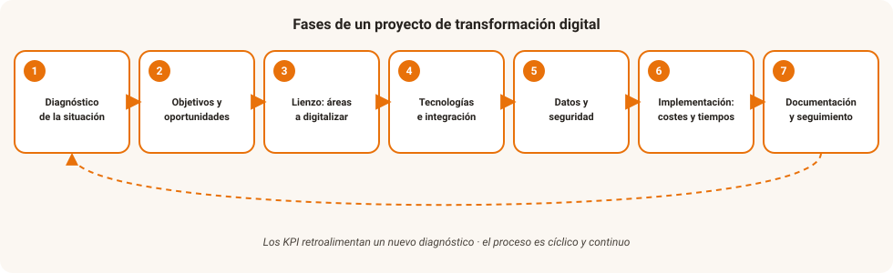

# UD6. Proyecto de transformación digital

!!! abstract "Resultado de aprendizaje"
    **RA6.** Desarrolla un proyecto de transformación digital de una empresa de un sector relacionado con el título, teniendo en cuenta los cambios que se deben producir en función de los objetivos de la empresa.

## 1. De la teoría a la práctica

A lo largo de las unidades anteriores hemos visto **qué** es la digitalización y por qué afecta a todos los sectores productivos (UD1), **qué tecnologías** la hacen posible (UD2), **dónde** se ejecutan buena parte de esos sistemas (UD3), **qué papel** juega la inteligencia artificial (UD4) y **cómo se evalúan y protegen** los datos que todo ello genera (UD5).

Esta última unidad cierra el módulo abordando una pregunta distinta: dada una organización real, ¿cómo se **diseña y ejecuta** un proyecto de transformación digital de principio a fin? Es la unidad más práctica del módulo y sirve de proyecto integrador de todo lo anterior.

## 2. Qué es un proyecto de transformación digital

Un **proyecto de transformación digital** es una iniciativa planificada, con objetivos, plazos y recursos definidos, orientada a incorporar tecnologías digitales que produzcan un cambio significativo en los procesos, el modelo de negocio o la cultura de una organización — no una simple compra de equipamiento o software aislada.

!!! tip "No confundir digitalizar con "comprar tecnología""
    Instalar un programa de facturación no es, por sí solo, un proyecto de transformación digital si no viene acompañado de un rediseño del proceso de trabajo, formación de las personas implicadas y un objetivo de negocio claro. La tecnología es el medio, no el fin.

## 3. Fases de un proyecto de transformación digital

### 3.1. Diagnóstico de la madurez digital

Antes de proponer ningún cambio, hay que conocer el punto de partida. El **diagnóstico de madurez digital** analiza, entre otros aspectos:

- Infraestructura tecnológica actual (equipos, conectividad, software).
- Procesos ya digitalizados frente a procesos manuales o en papel.
- Competencias digitales del personal.
- Cultura organizativa: ¿existe resistencia al cambio? ¿hay apoyo directivo?
- Nivel de madurez en el uso de datos para la toma de decisiones (UD5).

Existen modelos de madurez digital (habitualmente organizados en niveles, del 1 — "inicial", al 5 — "optimizado") que permiten situar a una organización y compararla con el estándar de su sector.

### 3.2. Definición de objetivos y alcance

A partir del diagnóstico se definen objetivos **concretos y medibles**. Es habitual aplicar el criterio **SMART**: específicos (*specific*), medibles (*measurable*), alcanzables (*achievable*), relevantes (*relevant*) y con un plazo definido (*time-bound*).

!!! reto "Reto: convierte un objetivo vago en un objetivo SMART"
    El objetivo "queremos digitalizar la empresa" no es SMART. Reformúlalo en un objetivo SMART para una pyme concreta que tú elijas (por ejemplo: "implantar un sistema de reservas online que reduzca las llamadas telefónicas de gestión de citas en un 50% en los próximos 6 meses").

### 3.3. Diseño del plan de digitalización (hoja de ruta)

El plan de digitalización traduce los objetivos en un conjunto ordenado de acciones, con responsables, plazos y recursos asignados. Debe considerar, como mínimo:

- Qué tecnologías se van a incorporar y en qué orden (relacionando con las estudiadas en las UD2, UD3 y UD4: ¿hace falta IoT? ¿se necesita migrar servicios a la nube? ¿tiene sentido incorporar IA en algún proceso?).
- Qué datos se van a generar o tratar, y qué medidas de calidad y protección de datos se aplicarán (UD5).
- Qué presupuesto es necesario y de dónde va a salir.
- Qué formación necesita el personal implicado.
- Qué riesgos existen y cómo se van a mitigar (incluida la ciberseguridad).

### 3.4. Selección de tecnologías y proveedores

En esta fase se decide, para cada necesidad identificada, qué solución concreta se va a implantar: por ejemplo, si conviene una solución en la nube pública o sería mejor una nube privada (UD3), qué proveedor ofrece mejores garantías de protección de datos (UD5), o si un proceso concreto se beneficiaría de automatización mediante RPA o inteligencia artificial (UD2 y UD4). Conviene comparar varias alternativas atendiendo no solo al precio, sino también a la escalabilidad, el soporte, el cumplimiento normativo y el riesgo de dependencia del proveedor (*vendor lock-in*, visto en la UD3).

### 3.5. Gestión del cambio y factor humano

La resistencia al cambio es una de las causas más frecuentes de fracaso de los proyectos de transformación digital, incluso cuando la tecnología elegida es la adecuada. La **gestión del cambio** incluye:

- Comunicación clara de los objetivos y beneficios del proyecto a todas las personas afectadas.
- Formación adaptada a los distintos perfiles y niveles de competencia digital.
- Implicación de las personas usuarias desde las primeras fases, no solo al final.
- Acompañamiento durante la transición (por ejemplo, mantener temporalmente el proceso anterior como alternativa mientras se consolida el nuevo).

### 3.6. Financiación y ayudas: el ejemplo del Kit Digital

En España, programas como el **Kit Digital** (financiado con fondos europeos) ofrecen ayudas económicas directas a pymes y autónomos para la contratación de soluciones de digitalización (ciberseguridad, comercio electrónico, gestión de procesos, presencia en internet, entre otras categorías). Conocer este tipo de instrumentos de financiación pública es relevante a la hora de diseñar el plan económico de un proyecto de digitalización, especialmente en pequeñas organizaciones con recursos limitados.

### 3.7. Gestión del proyecto: metodologías y herramientas

- **Metodologías tradicionales (en cascada)**: planificación detallada de principio a fin antes de empezar la ejecución; adecuadas para proyectos con requisitos muy estables.
- **Metodologías ágiles**: dividen el proyecto en ciclos cortos (*sprints*) con entregas incrementales, permitiendo ajustar el rumbo según los resultados obtenidos y el feedback recibido; especialmente adecuadas en proyectos de digitalización, donde es habitual que las necesidades se vayan afinando durante la propia ejecución.
- **Herramientas de apoyo**: diagramas de Gantt para planificar tareas y plazos, tableros tipo Kanban para gestionar el flujo de trabajo, herramientas colaborativas de gestión de proyectos y seguimiento de tareas.

### 3.8. Evaluación y seguimiento de resultados

Un proyecto de transformación digital no termina con la implantación de la tecnología: hay que medir si se han cumplido los objetivos definidos en la fase 3.2, mediante **indicadores clave de rendimiento (KPI)**, concepto ya presentado en la UD5 al hablar de paneles de control. Ejemplos de KPI en un proyecto de digitalización: tiempo medio de un proceso antes y después del cambio, reducción de errores o reclamaciones, ahorro de costes, grado de adopción de la nueva herramienta por parte del personal, o satisfacción de las personas usuarias.

Esta fase debe ser continua: los proyectos de transformación digital rara vez son un evento único, sino un proceso de **mejora continua** que se retroalimenta con nuevos diagnósticos.

## 4. Resumen visual del proceso

<figure markdown="span">
  { width="860" }
  <figcaption>Las fases se recorren en orden, pero la evaluación de resultados (KPI) retroalimenta un nuevo diagnóstico: la transformación digital es un proceso cíclico y continuo, no un proyecto con fin.</figcaption>
</figure>

---

## Caso práctico integrador

!!! reto "Proyecto final: plan de transformación digital de una pyme"
    Elige una pequeña empresa real o inventada, cercana a tu entorno (una peluquería, un taller mecánico, una tienda de barrio, una asesoría...). Elabora un documento breve (2-3 páginas) que incluya:

    1. **Diagnóstico**: describe su situación digital actual (qué usa, qué no usa, qué problema quieres resolver).
    2. **Objetivo SMART**: define un único objetivo claro y medible para el proyecto.
    3. **Tecnologías propuestas**: indica qué tecnologías de las estudiadas en el módulo (IoT, nube, IA, herramientas de datos...) usarías y por qué, relacionándolas explícitamente con las UD2, UD3, UD4 y UD5.
    4. **Datos**: qué datos personales o de negocio se generarían y qué medidas de protección aplicarías (RGPD).
    5. **Gestión del cambio**: qué resistencias podrías encontrar entre el personal y cómo las abordarías.
    6. **KPI de seguimiento**: al menos dos indicadores para medir si el proyecto ha tenido éxito.

    Este trabajo puede presentarse y defenderse oralmente en clase como cierre del módulo.

## Actividades

**Actividad 6.1 — Diagnóstico de madurez digital**

Aplicando los criterios del punto 3.1, realiza un diagnóstico breve de madurez digital de tu propio centro educativo o de un negocio que conozcas bien. Sitúalo en un nivel (inicial, básico, intermedio, avanzado u optimizado) y justifica la valoración.

**Actividad 6.2 — Comparativa de metodologías**

Explica, con un ejemplo concreto, en qué tipo de proyecto de digitalización preferirías una metodología en cascada y en qué tipo preferirías una metodología ágil. Justifica tu elección en ambos casos.

**Actividad 6.3 — El Kit Digital**

Consulta las categorías de ayuda disponibles actualmente en el programa Kit Digital (u otro programa de ayudas a la digitalización vigente) y relaciona al menos tres de esas categorías con contenidos vistos en este módulo.

## Autoevaluación

??? question "1. ¿Por qué instalar un nuevo programa de gestión no es, por sí solo, un proyecto de transformación digital?"
    Porque la transformación digital implica un cambio en los procesos, el modelo de negocio o la cultura de la organización, con formación de las personas implicadas y un objetivo claro; la tecnología es el medio, no un fin en sí mismo.

??? question "2. ¿Qué significa que un objetivo sea SMART?"
    Que sea específico, medible, alcanzable, relevante y con un plazo de tiempo definido.

??? question "3. Cita al menos tres elementos que debería incluir un plan de digitalización."
    Por ejemplo: qué tecnologías se incorporarán y en qué orden, qué datos se generarán y cómo se protegerán, el presupuesto necesario, la formación requerida y los riesgos identificados (se consideran correctos cualesquiera tres).

??? question "4. ¿Qué diferencia hay entre una metodología en cascada y una metodología ágil en la gestión de un proyecto?"
    La metodología en cascada planifica todo el proyecto de principio a fin antes de ejecutarlo, adecuada cuando los requisitos son estables. La metodología ágil divide el proyecto en ciclos cortos con entregas incrementales, permitiendo ajustar el rumbo según los resultados, más adecuada cuando las necesidades se van afinando durante la ejecución.

??? question "5. ¿Por qué la evaluación de resultados (KPI) no debe entenderse como la fase final y única de un proyecto de transformación digital?"
    Porque la transformación digital es un proceso de mejora continua: los resultados obtenidos deben retroalimentar un nuevo diagnóstico, dando lugar a sucesivos ciclos de mejora en lugar de un proyecto cerrado de una sola vez.
