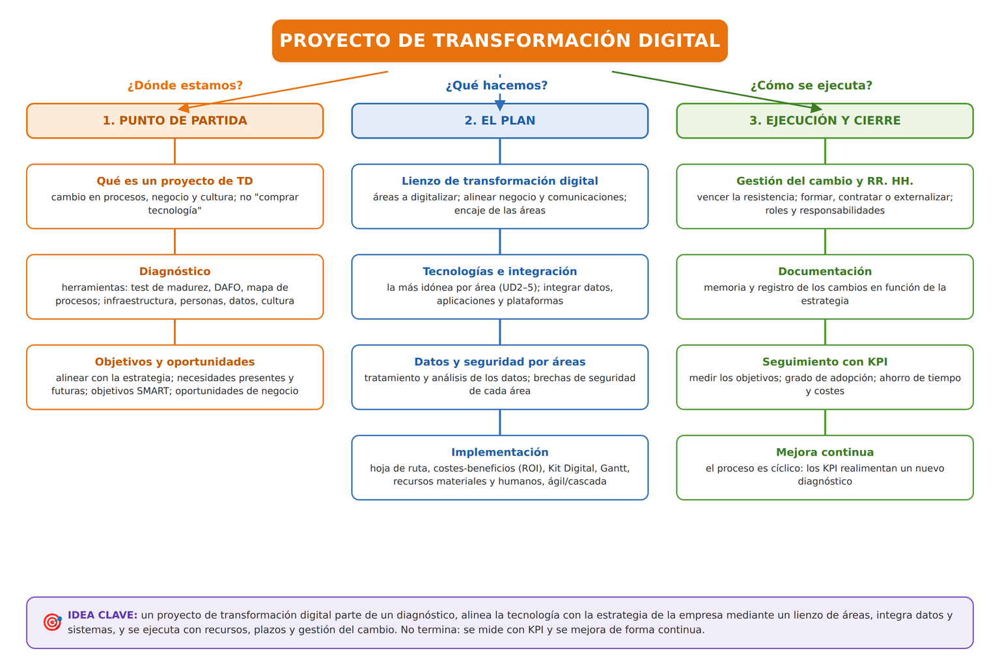

# UD6. Proyecto de transformación digital

!!! abstract "Resultado de aprendizaje"
    **RA6.** Desarrolla un proyecto de transformación digital de una empresa de un sector relacionado con el título, teniendo en cuenta los cambios que se deben producir en función de los objetivos de la empresa.

## 1. De la teoría a la práctica

A lo largo de las unidades anteriores hemos visto **qué** es la digitalización y por qué afecta a todos los sectores productivos (UD1), **qué tecnologías** la hacen posible (UD2), **dónde** se ejecutan buena parte de esos sistemas (UD3), **qué papel** juega la inteligencia artificial (UD4) y **cómo se evalúan y protegen** los datos que todo ello genera (UD5).

Esta última unidad cierra el módulo abordando una pregunta distinta: dada una organización real, ¿cómo se **diseña y ejecuta** un proyecto de transformación digital de principio a fin? Es la unidad más práctica del módulo y sirve de proyecto integrador de todo lo anterior.

## 2. Qué es un proyecto de transformación digital

Un **proyecto de transformación digital** es una iniciativa planificada, con objetivos, plazos y recursos definidos, orientada a incorporar tecnologías digitales que produzcan un cambio significativo en los procesos, el modelo de negocio o la cultura de una organización — no una simple compra de equipamiento o software aislada.

!!! tip "No confundir digitalizar con "comprar tecnología""
    Instalar un programa de facturación no es, por sí solo, un proyecto de transformación digital si no viene acompañado de un rediseño del proceso de trabajo, formación de las personas implicadas y un objetivo de negocio claro. La tecnología es el medio, no el fin.

## 3. Fases de un proyecto de transformación digital

Un proyecto de transformación digital se organiza en una secuencia de fases que, aunque se presentan en orden, se retroalimentan entre sí.

### 3.1. Diagnóstico de la situación de partida

Antes de proponer ningún cambio hay que conocer el punto de partida. Algunas **herramientas de diagnóstico** habituales:

- **Test de autodiagnóstico digital**: cuestionarios que sitúan a la empresa en un nivel de madurez (por ejemplo, el *Test de Diagnóstico Digital* de Acelera pyme / red.es).
- **Modelos de madurez digital**: escalas, normalmente de 5 niveles (del 1 "inicial" al 5 "optimizado"), para compararse con el estándar del sector.
- **Mapa de procesos**: inventario de los procesos de la empresa y de cómo se hacen hoy (manual, en papel, con hoja de cálculo, con una aplicación).
- **Análisis DAFO** centrado en lo digital: debilidades y fortalezas internas, amenazas y oportunidades del entorno.
- **Inventario tecnológico**: equipos, conectividad, aplicaciones, datos y su estado.

El diagnóstico debe cubrir la **infraestructura**, los **procesos**, las **competencias digitales del personal**, el uso de **datos** para decidir (UD5) y la **cultura** (¿hay resistencia al cambio?, ¿hay apoyo de la dirección?).

### 3.2. Objetivos estratégicos, necesidades y oportunidades de negocio

La transformación digital no es un fin en sí misma: debe servir a la **estrategia de la empresa**. Tras el diagnóstico conviene:

- **Identificar los objetivos estratégicos** de la organización (crecer, reducir costes, mejorar el servicio, abrir un canal de venta, cumplir una normativa…) y **alinear** cada iniciativa digital con al menos uno de ellos.
- Tener en cuenta las **necesidades presentes y futuras**: no solo el problema de hoy, sino hacia dónde quiere ir la empresa en 2-3 años (crecimiento previsto, nuevos mercados, relevo generacional).
- Detectar las **oportunidades de negocio** que abre la digitalización: nuevos productos o servicios digitales, nuevos canales y mercados, servitización, personalización, mejora de la experiencia de cliente o eficiencia que libera recursos (se apoya en UD1 y UD2).

Con todo ello se formulan los **objetivos del proyecto**, que conviene que sean **SMART**: específicos, medibles, alcanzables, relevantes y con un plazo definido.

!!! reto "Reto: convierte un objetivo vago en un objetivo SMART"
    El objetivo "queremos digitalizar la empresa" no es SMART. Reformúlalo en un objetivo SMART para una pyme concreta que tú elijas (por ejemplo: "implantar un sistema de reservas online que reduzca las llamadas telefónicas de gestión de citas en un 50 % en los próximos 6 meses").

### 3.3. El lienzo de transformación digital

El **lienzo (o *canvas*) de transformación digital** es una plantilla visual que ayuda a mapear, sobre una sola hoja, **qué áreas de la empresa se van a digitalizar** y cómo se relacionan. Áreas que suele contemplar:

| Área | Preguntas que plantea |
|---|---|
| **Clientes y experiencia** | ¿Cómo captamos, atendemos y fidelizamos? ¿Por qué canales? |
| **Procesos internos** | ¿Qué procesos son manuales o repetitivos y podrían automatizarse? |
| **Producto o servicio** | ¿Se puede añadir una capa digital (conectividad, servicios, datos)? |
| **Modelo de negocio** | ¿Aparecen nuevas formas de generar ingresos (suscripción, plataforma)? |
| **Datos** | ¿Qué datos generamos, cómo los guardamos y los analizamos? |
| **Personas y cultura** | ¿Qué competencias y qué cambio cultural hacen falta? |
| **Tecnología e infraestructura** | ¿Qué base necesitamos (red, nube, seguridad)? |

Un paso clave es **identificar y alinear las áreas de negocio/producción con las de comunicaciones y sistemas** (la convergencia IT-OT de la UD1): de poco sirve digitalizar la producción si la información no llega a la gestión, o al revés.

También hay que analizar el **encaje de las áreas ya digitalizadas entre sí y con las que no lo están**: evitar "islas digitales" que no se comunican y planificar la transición para que el proceso nuevo y el antiguo convivan durante un tiempo.

!!! question "💡 Comprueba que lo has entendido"
    Un taller digitaliza la recepción de vehículos con una app, pero el taller sigue anotando las reparaciones en papel y la facturación se hace aparte, en una hoja de cálculo que nadie conecta con la app.

    **¿Qué problema de encaje entre áreas hay y cómo lo reflejaría el lienzo?**

??? note "Ver respuesta"
    Se han creado **islas digitales**: la recepción está digitalizada pero no se comunica con reparaciones ni con facturación, así que el dato se vuelve a teclear varias veces. El lienzo mostraría que las áreas de **procesos internos** y **datos** están sin integrar, y que el siguiente paso es conectarlas antes de digitalizar nada más.

### 3.4. Selección de tecnologías idóneas e integración

Para cada necesidad detectada se elige la **tecnología más idónea en función de la empresa** (tamaño, sector, presupuesto, madurez). Ayuda relacionar cada área con las tecnologías del módulo:

| Necesidad / área | Tecnologías candidatas |
|---|---|
| Vender y atender por más canales | Comercio electrónico, CRM, chatbots (UD2, UD4) |
| Automatizar tareas administrativas | RPA, IA para leer documentos (UD2, UD4) |
| Controlar y monitorizar la producción | Sensores IoT, SCADA, gemelos digitales (UD2) |
| Guardar y compartir información | Servicios en la nube: IaaS / PaaS / SaaS (UD3) |
| Analizar datos y decidir | BI, ciencia de datos, IA (UD4, UD5) |
| Proteger la información | Copias, cifrado, MFA, plan director (UD5) |

Criterios de elección: además del precio, la **escalabilidad**, el **soporte**, el **cumplimiento normativo** y el **riesgo de dependencia del proveedor** (*vendor lock-in*, UD3).

**Integración en el conjunto.** Las soluciones no deben quedar aisladas: hay que planificar la **integración entre datos, aplicaciones y plataformas** para que un dato se introduzca una sola vez y fluya (APIs y conectores, formatos comunes, un modelo de datos coherente). El objetivo es evitar los **silos de información** y las dobles grabaciones.

### 3.5. Tratamiento de los datos y brechas de seguridad por áreas

**Tratamiento de los datos y su análisis.** El plan debe definir, para los datos que el proyecto va a generar o usar: qué datos son, dónde se almacenan, cómo se garantiza su calidad (UD5), quién y con qué herramientas los analiza, y qué indicadores (KPI) se obtendrán.

**Brechas de seguridad por áreas.** Para cada área que se digitaliza se analizan sus **posibles brechas de seguridad**: nuevos puntos de entrada (dispositivos IoT, accesos remotos, servicios en la nube), datos personales que pasan a tratarse, dependencia de un proveedor… y se definen las medidas (control de acceso, cifrado, copias, formación) con el enfoque de **seguridad desde el diseño** (UD2) y el **plan director de seguridad** (UD5).

!!! question "💡 Comprueba que lo has entendido"
    Una tienda añade una web con pasarela de pago, un TPV conectado y un servicio en la nube para la contabilidad.

    **Indica una brecha de seguridad asociada a cada una de esas tres áreas.**

??? note "Ver respuesta"
    - **Web con pasarela de pago**: datos personales y de tarjeta; riesgo de ataques web y de fuga de datos → cifrado (HTTPS), actualizaciones, no almacenar datos de tarjeta.
    - **TPV conectado**: nuevo dispositivo en la red; riesgo de malware o acceso no autorizado → segmentar la red, contraseñas robustas, actualizaciones.
    - **Contabilidad en la nube**: acceso remoto y dependencia del proveedor → MFA, mínimo privilegio, copias propias y revisar las garantías del proveedor.

### 3.6. Diseño de la implementación: hoja de ruta, costes, tiempos y recursos

El plan traduce los objetivos en un conjunto ordenado de acciones con responsables, plazos y recursos:

- **Hoja de ruta**: qué tecnologías se incorporan y en qué orden, qué formación hace falta y qué riesgos se mitigan.
- **Costes y beneficios**: se estima el **presupuesto** (licencias, equipos, servicios en la nube, formación, horas de trabajo) y los **beneficios** esperados (ahorro de tiempo y costes, más ingresos, menos errores). Comparar ambos da el **retorno de la inversión (ROI)** y ayuda a priorizar.
- **Financiación y ayudas**: programas como el **Kit Digital** (fondos europeos) ofrecen ayudas directas a pymes y autónomos para soluciones de digitalización (ciberseguridad, comercio electrónico, gestión de procesos, presencia en internet…); conviene contemplarlos en el plan económico.
- **Desarrollo temporal**: se ordenan las acciones en **fases e hitos**, con un **diagrama de Gantt** para plazos y dependencias y tableros **Kanban** para el seguimiento.
- **Recursos materiales y humanos**: qué equipos, software y servicios se necesitan y qué personas (propias o externas) participan y con qué dedicación.
- **Metodología de gestión**: *cascada* (planificación completa por adelantado, requisitos estables) o **ágil** (ciclos cortos con entregas incrementales y ajuste continuo, habitual en digitalización).

### 3.7. Gestión del cambio y recursos humanos

La resistencia al cambio es una de las causas más frecuentes de fracaso, incluso cuando la tecnología es la adecuada. La **gestión del cambio** incluye:

- Comunicación clara de los objetivos y beneficios a todas las personas afectadas.
- Formación adaptada a los distintos perfiles y niveles de competencia digital.
- Implicación de las personas usuarias desde las primeras fases, no solo al final.
- Acompañamiento durante la transición (por ejemplo, mantener temporalmente el proceso anterior mientras se consolida el nuevo).

Además hay que valorar la **idoneidad de los recursos humanos**: ¿el equipo tiene las competencias necesarias?, ¿hay que **formar**, **contratar** o **externalizar** parte del trabajo?, ¿quién asumirá el mantenimiento al terminar? Definir **roles y responsabilidades** (dirección del proyecto, referentes por área, soporte técnico) evita que todo dependa de una sola persona.

### 3.8. Documentación, seguimiento y mejora continua

**Documentar los cambios en función de la estrategia.** El proyecto debe dejar una **memoria**: qué se ha hecho y por qué, qué decisiones se tomaron, qué configuración se ha desplegado, qué formación se ha impartido y qué queda pendiente. Esta documentación da continuidad al proyecto y sirve para justificar la inversión ante la dirección o ante una ayuda pública.

**Seguimiento con KPI.** Hay que medir si se han cumplido los objetivos definidos en la fase 3.2 mediante **indicadores clave de rendimiento (KPI)** (UD5): tiempo medio de un proceso antes y después, reducción de errores o reclamaciones, ahorro de costes, grado de adopción de la nueva herramienta o satisfacción de las personas usuarias.

**Mejora continua.** La transformación digital rara vez es un evento único: los resultados retroalimentan un nuevo diagnóstico y dan lugar a sucesivos ciclos de mejora.

## 4. Resumen visual del proceso

<figure markdown="span">
  { width="900" }
  <figcaption>Las fases se recorren en orden, pero el seguimiento con KPI retroalimenta un nuevo diagnóstico: la transformación digital es un proceso cíclico y continuo, no un proyecto con fin.</figcaption>
</figure>

---

## Caso práctico integrador

!!! reto "Proyecto final: plan de transformación digital de una pyme"
    Elige una pequeña empresa real o inventada, cercana a tu entorno (una peluquería, un taller mecánico, una tienda de barrio, una asesoría...). Elabora un documento breve (2-3 páginas) que incluya:

    1. **Diagnóstico**: describe su situación digital actual (qué usa, qué no usa, qué problema quieres resolver).
    2. **Objetivo SMART**: define un único objetivo claro y medible para el proyecto.
    3. **Tecnologías propuestas**: indica qué tecnologías de las estudiadas en el módulo (IoT, nube, IA, herramientas de datos...) usarías y por qué, relacionándolas explícitamente con las UD2, UD3, UD4 y UD5.
    4. **Datos**: qué datos personales o de negocio se generarían y qué medidas de protección aplicarías (RGPD).
    5. **Gestión del cambio**: qué resistencias podrías encontrar entre el personal y cómo las abordarías.
    6. **KPI de seguimiento**: al menos dos indicadores para medir si el proyecto ha tenido éxito.

    Este trabajo puede presentarse y defenderse oralmente en clase como cierre del módulo.

## Actividades

**Actividad 6.1 — Diagnóstico de madurez digital**

Aplicando los criterios del punto 3.1, realiza un diagnóstico breve de madurez digital de tu propio centro educativo o de un negocio que conozcas bien. Sitúalo en un nivel (inicial, básico, intermedio, avanzado u optimizado) y justifica la valoración.

**Actividad 6.2 — Comparativa de metodologías**

Explica, con un ejemplo concreto, en qué tipo de proyecto de digitalización preferirías una metodología en cascada y en qué tipo preferirías una metodología ágil. Justifica tu elección en ambos casos.

**Actividad 6.3 — El Kit Digital**

Consulta las categorías de ayuda disponibles actualmente en el programa Kit Digital (u otro programa de ayudas a la digitalización vigente) y relaciona al menos tres de esas categorías con contenidos vistos en este módulo.

**Actividad 6.4 — Lienzo de transformación digital**

Elige una pyme (real o inventada) y rellena un lienzo de transformación digital sencillo con sus siete áreas (clientes y experiencia, procesos internos, producto o servicio, modelo de negocio, datos, personas y cultura, tecnología e infraestructura). Para cada área, anota una acción concreta de digitalización y marca cuáles quedarían integradas entre sí.

## Mapa conceptual

<figure markdown="span">
  { width="960" }
  <figcaption>Síntesis de la unidad: un proyecto de transformación digital se aborda desde su <strong>punto de partida</strong> (qué es, diagnóstico con herramientas, objetivos estratégicos y oportunidades de negocio), <strong>el plan</strong> (lienzo de áreas a digitalizar, tecnologías idóneas e integración de datos y aplicaciones, tratamiento de datos y seguridad por áreas, e implementación con costes, tiempos y recursos) y su <strong>ejecución y cierre</strong> (gestión del cambio y recursos humanos, documentación de los cambios, seguimiento con KPI y mejora continua).</figcaption>
</figure>

## Autoevaluación

??? question "1. ¿Por qué instalar un nuevo programa de gestión no es, por sí solo, un proyecto de transformación digital?"
    Porque la transformación digital implica un cambio en los procesos, el modelo de negocio o la cultura de la organización, con formación de las personas implicadas y un objetivo claro; la tecnología es el medio, no un fin en sí mismo.

??? question "2. Cita tres herramientas de diagnóstico de la situación de partida."
    Por ejemplo: un test de autodiagnóstico digital (como el de Acelera pyme / red.es), un modelo de madurez digital por niveles, un mapa de procesos, un análisis DAFO centrado en lo digital y un inventario tecnológico.

??? question "3. ¿Qué diferencia hay entre los objetivos estratégicos de la empresa y los objetivos del proyecto de digitalización?"
    Los objetivos estratégicos son las metas del negocio (crecer, reducir costes, mejorar el servicio, abrir un canal). Los objetivos del proyecto son metas SMART concretas que dan soporte a los estratégicos; cada iniciativa digital debe alinearse con al menos un objetivo estratégico.

??? question "4. ¿Qué significa que un objetivo sea SMART?"
    Que sea específico, medible, alcanzable, relevante y con un plazo de tiempo definido.

??? question "5. ¿Para qué sirve el lienzo de transformación digital?"
    Es una plantilla visual que permite mapear en una sola hoja qué áreas de la empresa se van a digitalizar (clientes, procesos, producto, modelo de negocio, datos, personas, tecnología), cómo se relacionan entre sí y cómo encajan las áreas digitalizadas con las que no lo están, evitando "islas digitales".

??? question "6. ¿Qué significa "integración en el conjunto" al elegir tecnologías?"
    Que las soluciones no queden aisladas: que datos, aplicaciones y plataformas se comuniquen (APIs, formatos comunes, un modelo de datos coherente) de modo que un dato se introduzca una sola vez y fluya, evitando silos de información y dobles grabaciones.

??? question "7. Al digitalizar un área nueva, ¿qué hay que analizar respecto a sus datos y a su seguridad?"
    Para los datos: qué datos genera o usa, dónde se almacenan, cómo se garantiza su calidad, quién y con qué herramientas los analiza y qué KPI se obtendrán. Para la seguridad: las posibles brechas de esa área (nuevos puntos de entrada como dispositivos IoT o accesos remotos, datos personales que pasan a tratarse, dependencia de un proveedor) y las medidas para cubrirlas, con enfoque de seguridad desde el diseño.

??? question "8. Cita al menos tres elementos que debería incluir un plan de digitalización."
    Por ejemplo: qué tecnologías se incorporarán y en qué orden, qué datos se generarán y cómo se protegerán, el presupuesto necesario, la formación requerida y los riesgos identificados (se consideran correctos cualesquiera tres).

??? question "9. En el diseño de la implementación, ¿qué se analiza al comparar costes y beneficios?"
    Se estima el presupuesto (licencias, equipos, servicios en la nube, formación, horas) frente a los beneficios esperados (ahorro de tiempo y costes, más ingresos, menos errores); su comparación da el retorno de la inversión (ROI) y ayuda a priorizar. También se contemplan las ayudas públicas, como el Kit Digital.

??? question "10. ¿Qué diferencia hay entre una metodología en cascada y una metodología ágil en la gestión de un proyecto?"
    La metodología en cascada planifica todo el proyecto de principio a fin antes de ejecutarlo, adecuada cuando los requisitos son estables. La metodología ágil divide el proyecto en ciclos cortos con entregas incrementales, permitiendo ajustar el rumbo según los resultados, más adecuada cuando las necesidades se van afinando durante la ejecución.

??? question "11. ¿Por qué la gestión del cambio y la idoneidad de los recursos humanos son decisivas en un proyecto de transformación digital?"
    Porque la resistencia al cambio es una de las causas más frecuentes de fracaso, incluso con la tecnología adecuada: hace falta comunicar objetivos y beneficios, formar según los perfiles e implicar a las personas usuarias desde el principio. Además hay que valorar si el equipo tiene las competencias necesarias o si hay que formar, contratar o externalizar, y definir roles y responsabilidades para que el proyecto no dependa de una sola persona.

??? question "12. ¿Por qué es importante documentar los cambios de un proyecto de transformación digital?"
    Porque la memoria del proyecto (qué se hizo y por qué, qué decisiones y configuración, qué formación, qué queda pendiente) da continuidad al trabajo, evita que dependa de una sola persona y sirve para justificar la inversión ante la dirección o ante una ayuda pública.

??? question "13. ¿Por qué la evaluación de resultados (KPI) no debe entenderse como la fase final y única de un proyecto de transformación digital?"
    Porque la transformación digital es un proceso de mejora continua: los resultados obtenidos deben retroalimentar un nuevo diagnóstico, dando lugar a sucesivos ciclos de mejora en lugar de un proyecto cerrado de una sola vez.
